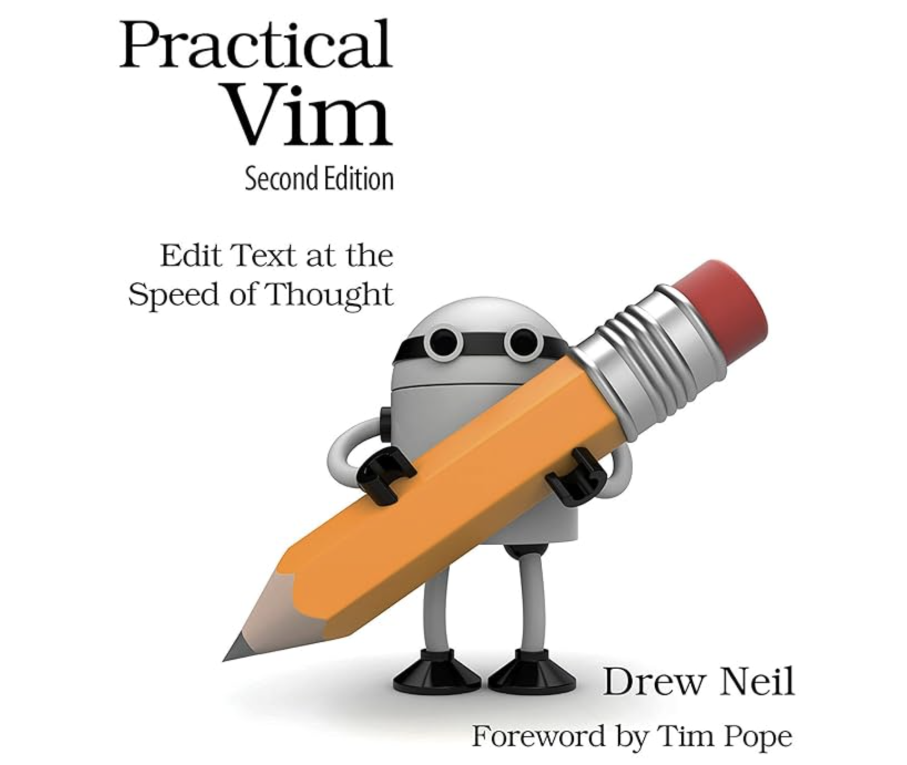

# 编辑器（Vim）

> 声明：本笔记参照 [郁结YuJie](https://space.bilibili.com/523426907) 的系列视频 [【Vim】可能是B站最系统的Vim教程](https://www.bilibili.com/video/BV1s4421A7he/) 制作，仅作学习分享使用。如有侵权，敬请联系删除。

## 一、Vim 文本编辑器简介

**Vim** 是终端下的著名文本编辑器，被称为“编辑器之神”。它有着高度活跃的社区支持，丰富的插件生态，使其在编辑器领域中享有极高的声誉。Vim 模式不仅在 Vim 自身广泛使用，还被许多集成开发环境（如 VS Code 和 JetBrains 系列 IDE）所支持，这反映了 Vim 在开发者社区的广泛认可度。即便你不直接在 Vim 中进行开发，学习并掌握 Vim 的操作模式依然能帮助你在其他工具中提高编辑效率。

Vim 非常适合用于编辑纯文本文件，尤其是在处理代码文件、Markdown 文件或者 LaTeX 源码时，Vim 的强大功能能让你的工作如虎添翼。

### 学习资源

[郁结YuJie](https://space.bilibili.com/523426907)学习 Vim 的主要资源是《Practical Vim》一书，中文译本为《Vim 使用技巧》。书的封面上有一句话：“Edit text at the speed of thought”（用思维的速度编辑文本），这句话精准地描述了 Vim 的核心优势。



为了实现这种高效编辑，Vim 主要依赖以下三大核心点：

1. **高效的移动**
2. **高效的编辑**
3. **高效的批量操作**

本教程也将围绕这三点进行讲解。

### 安装及配置

Vim 可以很方便地在 Linux 和 macOS 系统中安装，在 Windows 系统中则可以通过 WSL（Windows Subsystem for Linux）来使用。为了简化，本教程假设大家已经成功安装了 Vim。

### 打开文件

在终端中使用 `vim 文件名` 命令即可打开一个文件。我接下来的所有操作都会同步显示在屏幕下方，方便你学习和参考。

### Vim 模式介绍

Vim 是一个多模式的文本编辑器，主要有四种常用的模式：
1. **Normal 模式**：用于浏览和执行命令，默认模式。
2. **Insert 模式**：用于插入文本。
3. **Command 模式**：执行文件管理和操作命令（如保存、退出等）。
4. **Visual 模式**：用于选择和操作文本。

每种模式都有不同的应用场景，接下来我们从最基础的 **Normal 模式** 开始讲解。

### Normal 模式

当你打开一个文件时，Vim 默认进入 **Normal 模式**。在该模式下，你无法直接输入文本，而是通过命令来移动光标、编辑文本等。以下是 Normal 模式下一些常用的基础命令：

#### 光标移动命令

1. **上下左右移动**：
   - `h`：向左移动光标。
   - `j`：向下移动光标。
   - `k`：向上移动光标。
   - `l`：向右移动光标。

   将右手自然放置在键盘上，食指对应 `j` 键，`j` 和 `k` 用于上下移动光标，`h` 和 `l` 则用于左右移动。这是 Vim 最基本的光标移动方式。

2. **快速跳转到文件开头或结尾**：
   - `gg`：跳转到文件的第一行。
   - `G`：跳转到文件的最后一行。

   这两个命令相当于其他编辑器中的 `Home` 和 `End` 功能。

3. **翻页操作**：
   - `Ctrl+u`：向上翻半页。
   - `Ctrl+d`：向下翻半页。

   半页是指当前屏幕显示行数的一半。比如当前屏幕显示 20 行，`Ctrl+d` 会向下翻大约 10 行，`Ctrl+u` 则向上翻 10 行。

4. **跳转到指定行**：
   - 输入行号并按 `gg`，即可跳转到对应行。
   - 例如，`15gg` 跳转到第 15 行，`50gg` 跳转到第 50 行。

5. **调整光标位置在屏幕中的显示**：
   - `zz`：将光标所在行置于屏幕中央。
   - `zt`：将光标所在行置于屏幕顶部。
   - `zb`：将光标所在行置于屏幕底部。

   这些命令在你需要查看更多上下文时非常实用。

### Normal 模式的移动与编辑

上面我们介绍了 Vim 文本编辑器的基本移动命令。除了光标的上下左右移动（`H`、`J`、`K`、`L`）外，还有一些用于跳转和页面滚动的命令，如 `gg` 跳到文件首行、`G` 跳到末行，以及 `Ctrl+U` 和 `Ctrl+D` 来进行半页翻动。

当使用命令如 `19GG` 跳转到第 19 行时，光标可能会在屏幕的底部位置，这在阅读上下文时并不方便。我们可以使用以下命令来调整光标行的位置：
- `zz`：将光标所在行移动到屏幕的中央。
- `zt`：将光标所在行移动到屏幕的顶部。
- `zb`：将光标所在行移动到屏幕的底部。

### Insert 模式的切换与编辑

在 Normal 模式下，Vim 提供四个主要的命令来进入插入模式进行文本编辑，分别是：
- **`i`**：在当前光标前插入文本。
- **`a`**：在当前光标后插入文本。
- **`o`**：在光标所在行的下一行插入新行并开始输入。
- **`s`**：删除光标所在字符，并进入插入模式。

这些命令都可以通过按下 `ESC` 键返回 Normal 模式。

此外，`I` 和 `A` 的大写版本具有特定功能：
- **`I`**：在当前行的开头插入文本。
- **`A`**：在当前行的末尾插入文本。
- **`O`**：在光标所在行的上一行插入新行并开始输入。

这些命令之间存在一定的关联性，方便记忆。例如，`i` 和 `I` 都与行的开头位置相关，而 `a` 和 `A` 则与行的末尾相关。

### Command 模式

在 Normal 模式下，按下 `:` 进入 Command 模式，光标会移动到屏幕的最下方，等待输入命令。常用的文件操作命令有：
- **`:w`**：保存文件（`write`）。
- **`:q`**：退出文件（`quit`）。
- **`:wq`**：保存并退出。
- **`:q!`**：强制退出，不保存修改。

若想了解某个命令的详细信息，可以使用 `:help` 命令。例如输入 `:help I` 可以查看 `I` 命令的帮助文档。退出帮助文档时，使用 `:q`。

### Visual 模式

按下 `v` 可以进入 Visual 模式，用于选择文本。光标移动时，会选中经过的文本。常见操作有：
- **`x`**：剪切选中的文本。
- **`y`**：复制选中的文本。
- **`p`**：在 Normal 模式下粘贴复制的内容。

此外，按 `V` 进入行可视模式（Visual Line Mode），这时光标每次移动会选中整行文本，方便对多行进行操作。

### 与其他编辑器命令的对比

Vim 的命令体系与其他常见编辑器有许多相似之处，可以通过以下对比方便记忆：
- **光标移动**：HJKL 替代了方向键。
- **跳转到文件首尾**：`gg` 和 `G` 替代了 `Home` 和 `End`。
- **翻页**：`Ctrl+U` 和 `Ctrl+D` 替代了 `Page Up` 和 `Page Down`。
- **剪切、复制、粘贴**：`x`、`y`、`p` 分别替代了 `Ctrl+X`、`Ctrl+C` 和 `Ctrl+V`。

在这一节中，我们学习了 Vim 的四种模式以及如何在这些模式下进行基本操作。掌握这些基础命令后，可以高效地进行文本移动、插入、编辑和批量操作，这也是 Vim 高效性的核心所在。

## 二、移动与编辑

### 高级光标移动命令

在上一节中，我们学习了 Normal 模式下基本的光标移动命令（如 `H`、`J`、`K`、`L`），但这些基础命令在实际编辑中可能不够高效。因此，在这一节中，我们将介绍一些 **高级的光标移动命令**，帮助你更高效地在文本中跳转。

#### 1. 基于单词的移动

在 Vim 中，基于单词的移动命令可以极大提高效率，尤其在处理英文文本时，Vim 将字符之间的空格视为分隔符，从而可以定义“单词”的边界。

- **`w`**（`word`）：跳到下一个单词的开头。
  - 例如，按 `w` 会依次跳到下一个单词的开头，`www` 会让光标跳过三个单词。
  
- **`b`**（`back`）：跳到前一个单词的开头。
  - 类似于 `w`，但 `b` 是反向跳跃。例如，按 `b` 会让光标跳到当前或前一个单词的开头。

- **`e`**（`end`）：跳到下一个单词的结尾。
  - 按 `e` 可以跳到当前单词的末尾或下一个单词的末尾。

- **`ge`**：跳到前一个单词的结尾。
  - `ge` 与 `e` 类似，但方向相反。

#### 2. 大写命令的区别

这些命令的 **大写版本** 会忽略标点符号，将标点与单词一起处理，定义为“非空的连续字符”：
- **`W`**：跳到下一个不含标点的单词开头。
- **`B`**：跳到前一个不含标点的单词开头。
- **`E`**：跳到下一个不含标点的单词结尾。
- **`gE`**：跳到前一个不含标点的单词结尾。

例如，小写的 `w` 会把 `"open-source"` 视作三个单词（`open`、`-`、`source`），而大写的 `W` 会将整个 `"open-source"` 视为一个单词。

#### 3. 基于字符的移动

Vim 提供了在 **行内** 快速移动到某个字符的命令：
- **`f{char}`**：跳到当前行中下一个 `{char}` 字符的位置。
- **`t{char}`**：跳到当前行中下一个 `{char}` 前一个字符的位置（即“to”某个字符之前）。

例如，`fa` 会让光标跳到当前行中第一个 `a` 字符的位置，而 `ta` 会让光标停在 `a` 前一个字符处。

- **分号（`;`）** 和 **逗号（`,`）**：
  - 按 **`;`** 会重复上一个 `f` 或 `t` 操作，继续查找下一个匹配的字符。
  - 按 **`,`** 会反向重复上一个 `f` 或 `t` 操作。

- 大写的 `F` 和 `T` 分别是 **向左查找** 的版本：
  - **`F{char}`**：向左跳到下一个 `{char}` 位置。
  - **`T{char}`**：向左跳到 `{char}` 前一个字符。

#### 4. 基于模式的搜索

除了在行内移动字符，Vim 还支持全局搜索功能，使用 **斜杠（`/`）** 和 **问号（`?`）** 可以在整个文件中查找字符串：
- **`/pattern`**：向下查找 `pattern`，可以使用正则表达式。
- **`?pattern`**：向上查找 `pattern`。

例如，输入 `/vim` 后按 `Enter`，光标会跳到下一个匹配的 `vim` 字符串的位置。如果开启了搜索高亮功能，所有匹配的字符串都会被高亮显示。

#### 5. 快速重复查找

Vim 提供了快速重复查找的功能：
- **`n`**：重复上一个 `/` 或 `?` 查找操作，向下查找下一个匹配项。
- **`N`**：反向重复查找，向上查找上一个匹配项。

#### 6. 快速搜索当前单词

当你想查找当前光标所在的单词时，可以使用 **`*`** 和 **`#`**：
- **`*`**：查找光标所在单词的下一个匹配项。
- **`#`**：查找光标所在单词的上一个匹配项。

例如，光标位于 `vim` 上时，按 `*` 会搜索下一个出现的 `vim`，按 `#` 则会向上搜索前一个 `vim`。


### 基于标记的移动

在 Vim 中，**标记（Mark）** 功能类似于我们平时上网时保存书签，用来在文本中记录某个位置，以便稍后快速返回。这个功能在编辑长文本或代码时尤为有用，特别是在需要频繁跳转时。接下来我们介绍 Vim 中如何使用标记来高效地移动光标。

#### 1. 标记的创建和跳转

- **创建标记**：在 Vim 中，通过按 `m` 再加上一个字母（`a` 到 `z`）来标记当前位置。例如，输入 `mm` 就会将当前光标位置标记为 `m`。
- **跳转到标记**：要跳回标记的位置，可以使用 **反引号（\`）** 加上标记字母，例如 \\`m 会跳回标记为 m 的位置。

**例子**：
假设你正在编辑代码，并需要跳转到文件开头进行修改，但希望之后能够快速返回当前光标所在的代码段。你可以：

1. 使用 `mm` 将当前位置标记为 `m`。
2. 跳到文件开头（例如使用 `gg`）。
3. 完成修改后，输入 \\`m，光标会直接跳回到标记 m 所在的地方。

#### 2. 标记的准确性

标记不仅仅是记录光标所在的行号，它会精准记住光标在文件中的实际位置，甚至在你插入或删除了文本之后，标记仍能正确跳回到修改前的位置。例如：
- 如果你在光标标记 `mm` 后，在标记前插入了新行，之后使用 `\`m`，光标仍然会跳回到插入之前的文本位置，而不是行号位置。

#### 3. 内置标记

除了用户自定义的标记，Vim 还提供了一些 **内置标记**，可以自动记录光标跳转前、修改前等特定位置：
- **反引号（\``）**：记录上一次跳转前的光标位置。例如，你从 `vector` 跳转到文件开头，然后按\`` 就会跳回到 vector 处。
- **单引号（'）**：记录上次跳转到的行。
- **`.**：记录上次修改的光标位置。
- **`^**：记录上次插入的光标位置。

#### 4. 行首和行尾的快捷跳转

- **`^`**：跳到当前行的开头（第一个非空字符）。
- **`$`**：跳到当前行的结尾。
- **`%`**：跳到匹配的括号、花括号或引号。

**例子**：
1. 你可以使用 `^` 快速跳到当前行的第一个非空字符。
2. 使用 `%` 可以在匹配的括号或引号之间跳转。例如，如果光标在一个左括号上，按下 `%` 会跳到相应的右括号。

#### 5. 配对符号的跳转

Vim 还支持通过 `%` 来在 **成对符号** 之间进行跳转。成对符号包括：
- 圆括号 `()`
- 花括号 `{}` 
- 方括号 `[]`
- 引号 `""`、`''`
- 注释符号

**例子**：
1. 如果光标在左括号 `(` 上，按 `%` 会跳到相应的右括号 `)`。
2. 在注释块的起始符号 `/*` 上按 `%`，光标会跳到注释结束符 `*/`。

#### 6. 键盘快捷键记忆技巧

`^`、`$` 和 `%` 对应键盘上的 `Shift+6`、`Shift+4` 和 `Shift+5`，可以通过这种顺序来帮助记忆它们的功能：
- `^`：行首
- `$`：行尾
- `%`：匹配的符号


### 高效编辑——Operator + Motion

在 Vim 中，高效编辑的核心在于使用 **Operator + Motion** 的组合。这个组合模式是 Vim 强大编辑功能的基础，允许你通过简单的命令对文本进行复杂的编辑操作。

#### 1. Operator + Motion 基本公式

- **Motion**：任何能移动光标的命令，比如我们之前介绍的基于单词、标记、搜索的移动命令，都是 Motion。
- **Operator**：操作符，定义你对文本要进行的操作，如删除、复制、改变等。

当你在 Motion 前加上 Operator 时，Vim 会将光标当前位置到移动后的光标位置之间的范围作为操作对象。

#### 常见的 Operator：
- **`d`**：删除。
- **`y`**：复制（Yank）。
- **`c`**：改变（删除并进入插入模式）。

#### 2. Operator + Motion 例子

- **`dgg`**：删除光标当前行到文件开头的所有内容。
  - `gg` 是跳转到文件开头，`dgg` 则是从当前行删除到文件开头。
  
- **`ye`**：复制从光标当前位置到单词结尾的内容。
  - `e` 会跳到当前单词的结尾，`ye` 则会复制到该位置。

- **`d$`**：删除光标当前位置到行尾的内容。
  - `$` 会将光标跳到行尾，`d$` 则删除到行尾。

- **`dT;`**：删除光标当前位置到本行下一个分号之前的内容。
  - `T;` 会移动光标到分号前一个字符，`dT;` 则删除这一段内容。

#### 3. Operator + Motion 的灵活性

通过自由组合不同的 Operator 和 Motion，可以执行各种复杂的操作。例如：
- **`d%`**：删除从当前光标位置到匹配的括号或注释的另一侧。
  - `%` 是跳转到匹配的括号、花括号或引号，`d%` 则会删除这对符号之间的内容。

- **`/int` + `d//`**：搜索 `int` 并删除到下一个匹配的 `int`。
  - 首先 `/int` 查找 `int`，然后用 `d//` 删除光标当前位置到下一个 `int` 之间的内容。

#### 4. 连续操作符（连按两次 Operator）

当你想对整行进行操作时，可以连按两次操作符：
- **`dd`**：删除整行。
- **`yy`**：复制整行。

这些快捷操作在编辑代码时非常常用，极大地简化了操作步骤。

### 重复操作：点号（`.`）

Vim 提供了 **`.`（点号）** 来重复上一次的修改操作。无论是删除、复制、粘贴还是修改，只要你使用过一次操作，按 `.` 就可以重复这个操作。

#### 例子：
- **`dw`**：删除到下一个单词开头。
  - 按 `.` 重复上一次的 `dw` 操作，再次删除到下一个单词开头。
  
- **`c$`**：改变从光标到行尾的文本。
  - 按 `.` 可以重复这个改变，继续修改下一个行尾。

### 撤销与重做

Vim 允许你轻松撤销和重做修改：
- **`u`**：撤销（Undo）上一次的操作。
  - 可以连续按 `u` 撤销多次，恢复到更早的状态。
  
- **`Ctrl+R`**：重做（Redo）操作。
  - 如果你撤销后发现不小心撤销了太多，可以通过 `Ctrl+R` 重做刚才的修改。

### 数字 + 动作的操作模式

除了 **Operator + Motion**，在 Vim 中还有一种高效的操作模式：**数字 + 动作**。这种模式允许你在动作前加上一个数字，从而指定动作重复的次数。无论是移动还是编辑，都可以通过在前面添加数字来批量操作。

#### 1. 数字 + 移动命令

通过在移动命令前加数字，可以让光标一次性移动多行或多次。

- **`4j`**：向下移动 4 行。
- **`5k`**：向上移动 5 行。
- **`3w`**：向前跳 3 个单词。
- **`2b`**：向后跳 2 个单词。

#### 2. 数字 + 编辑命令

同样，编辑命令也可以通过在前面加上数字来批量执行。

- **`3dw`**：删除接下来的 3 个单词。
- **`2yy`**：复制当前行及接下来的 1 行，即复制 2 行。
- **`4p`**：粘贴 4 次，结果会是粘贴内容的 4 倍。

**例子**：
1. **`3dw`**：删除光标位置到第三个单词开头之间的文本。
2. **`yy`**：复制当前行，**`2yy`** 会复制两行。
3. **`p`**：粘贴复制的内容，**`4p`** 会连续粘贴 4 次，效果是粘贴四倍的内容。

#### 3. 数字 + 动作的批量操作

这种模式非常适合需要大批量操作的场景。例如：
- 你可以在连续多行文本上执行同一操作，而不需要一行行重复命令。
- 数字模式让操作更为直接、明确，语义清晰。

#### 4. 数字 + 动作 vs 点命令（`.`）

- **数字 + 动作**：适用于你已明确知道需要进行几次操作的场景。比如当你知道要删除 4 行时，你可以直接使用 `4dd` 删除四行。这种方式非常精确。
- **点命令（`.`）**：则适用于你想动态地重复上一次操作，特别是在你不知道确切的操作次数时非常有用。例如，连续按 `.` 可以逐次删除你想要的内容，直到满意为止。

**区别**：
- 使用 **数字 + 动作** 你必须预先知道你要执行多少次操作，而使用 **点命令** 可以逐步重复操作，直到达到预期效果。
- **点命令** 更加灵活，因为你可以随时停止操作，而 **数字 + 动作** 一旦执行，就会完全按照指定次数操作。

#### 5. 相对行号（Relative Number）

当需要执行基于行的批量操作时，启用 **相对行号**（relative number）是一个非常有用的技巧。相对行号会显示当前行与其他行的相对位置，从而帮助你更直观地判断要操作的行数。

- 启用相对行号：
  ```vim
  :set relativenumber
  ```
  启用后，当前行的行号保持不变，而其他行的行号会显示为相对于当前行的偏移量。

- **例子**：
  你可以清楚地看到目标行与当前行的相对距离。例如，当注释行距离当前行 4 行时，输入 `4dd` 就能直接删除这些行。

- 关闭相对行号：
  ```vim
  :set norelativenumber
  ```
  行号恢复为正常模式，显示文件中的绝对行号。


## 三、文本对象操作

### Operator + Text Object

在上一节中，我们介绍了 **Operator + Motion** 的操作逻辑，本质上是基于光标的移动位置来确定操作范围。在这一节中，我们将介绍另一种重要的操作方式：**Operator + Text Object**。它让我们可以对具有特定语义的文本对象进行操作，而不仅仅是基于光标的移动。

#### 1. 什么是 Text Object？

**Text Object**（文本对象）是 Vim 中的一种概念，指的是具有特定语义的文本片段，通常是单词、句子、段落或括号内的内容等。通过使用 Text Object，Vim 可以识别这些特定的结构化文本，并将其作为一个整体进行编辑。

##### 常见的 Text Object 包括：
- **`w`**：单词（`word`）
- **`s`**：句子（`sentence`）
- **`p`**：段落（`paragraph`）
- **括号类符号**：如小括号 `()`、中括号 `[]`、花括号 `{}`、引号 `""`、尖括号 `<>` 等

#### 2. `i` 和 `a` 的区别

在 Vim 中，Text Object 前面的 **`i`** 和 **`a`** 分别代表两种模式：
- **`i`（inner）**：操作对象内部的文本，排除边界符号（如括号）。
- **`a`（around）**：操作对象及其边界符号（如括号或前后的空格）。

##### 例子：
- **`iw`**：表示单词内部，不包括前后的空格。
- **`aw`**：表示整个单词，包括前后的空格。
- **`i(`** 或 **`ib`**：表示括号内部的内容，不包括括号本身。
- **`a(`** 或 **`ab`**：表示括号及其内部的内容，包含括号本身。

#### 3. Operator + Text Object 的使用

与 **Operator + Motion** 类似，**Operator + Text Object** 允许你对特定的文本对象进行操作。

##### 常见的操作符包括：
- **`d`**：删除
- **`y`**：复制
- **`c`**：修改

##### 例子：
- **`diw`**：删除光标所在单词的内部字符，不包括前后的空格。
- **`daw`**：删除光标所在单词，包括其后面的空格。
- **`ci(`**：修改括号内部的内容，不包括括号本身。
- **`ca(`**：修改括号及其内部的内容，包括括号本身。

**操作演示**：
- 如果光标位于单词 `win` 中，执行 `diw` 会删除该单词的内容，但不删除后面的空格。
- 如果使用 `daw`，则会删除整个单词及其后面的空格。

#### 4. Text Object 的灵活性

Text Object 的强大之处在于它能够基于文本的结构进行操作，具有很高的灵活性和明确性。例如：
- **`ci(`** 可以在括号内部的任意位置进行操作，只要光标在括号内部，无论光标位于括号的哪个字符上，都会正确选中括号内的内容进行修改。
- **`yi{`** 可以复制花括号 `{}` 内部的内容，而不包括花括号本身。

#### 5. Operator + Text Object vs Operator + Motion

- **Operator + Motion**：基于光标位置和移动位置来确定操作范围，移动的范围是由光标和移动后的目标决定的，范围较为灵活。
- **Operator + Text Object**：基于预定义的文本结构操作，操作对象明确，且不依赖光标的具体位置。它可以更精确地对特定的语义单元进行操作。

**区别**：
1. **Motion** 命令可以独立使用。例如 `w` 可以单独用于跳转到下一个单词。
2. **Text Object** 不能单独使用，它必须与一个 Operator 结合使用（例如 `diw`），否则会进入插入模式。
3. **Text Object** 的范围定义更加明确，比如括号内的内容可以通过 `i(` 或 `a(` 精确选择，而 Motion 则依赖于光标移动。

#### 6. Vim 中的扩展与自定义

Vim 允许用户通过插件扩展 Text Object 和 Operator 的功能。例如，一些插件可以引入新的文本对象（如 HTML 标签或 Markdown 标记），从而增强 Vim 的编辑能力。虽然本教程不涉及插件，但用户可以根据需要自行探索和安装相关扩展。

### 操作符的补充

#### 1. 字符大小写转换

Vim 提供了一些操作符，用于对字符进行大小写转换：
- **`gu`**：将文本转换为小写。
- **`gU`**：将文本转换为大写。
- **`g~`**：翻转字符的大小写。

##### 例子：
- **`guw`**：将光标所在单词转换为小写。
- **`gUw`**：将光标所在单词转换为大写。
- **`g~w`**：翻转光标所在单词的大小写。

#### 2. 行连接

- **`J`**：连接当前行与下一行。
  - 小写 `j` 是向下移动光标一行，而大写 `J` 则是将当前行和下一行连接起来，形成一行文本。

##### 例子：
- 光标位于某行时，按下 **`J`**，当前行将与下一行连接，不留空格。

#### 3. 数字增减

Vim 还支持对文本中的数字进行增减操作，特别适合在需要修改数值时：
- **`Ctrl+A`**：增加数字（找到光标所在行的下一个数字，并将其加 1）。
- **`Ctrl+X`**：减少数字（找到光标所在行的下一个数字，并将其减 1）。

可以在操作前加上数字，指定增减的幅度：
- **`10Ctrl+A`**：将光标所在的数字增加 10。
- **`5Ctrl+X`**：将光标所在的数字减少 5。

#### 4. 递增序列生成

- **`g Ctrl+A`**：用于生成递增的数字序列，特别适合在编辑时创建编号或行号。
  - 当你选中多行文本后，按下 **`g Ctrl+A`**，每行的数字会依次递增。

##### 例子：
假设你有几行文本，每行都有一个数字，你可以选中这些行并按 **`g Ctrl+A`**，Vim 会根据每行的数字递增一个序列，非常适合创建行号或序列号。

#### 5. 缩进调整

- **`>`**：增加缩进。
- **`<`**：减少缩进。

##### 例子：
- **`>>`**：增加当前行的缩进。
- **`<<`**：减少当前行的缩进。
- **`>5j`**：增加光标所在行及接下来的 5 行的缩进。
- **`<5j`**：减少光标所在行及接下来的 5 行的缩进。

#### 6. 模块化命令与重复操作

在 Vim 中，我们可以通过清晰、明确的命令来实现更加模块化的编辑。例如，虽然 `dw` 可以删除光标到单词结尾的内容，但它并不总是能删除整个单词，尤其当光标不在单词的开头时。相比之下，使用 **`daw`**（删除整个单词及后面的空格）更具语义清晰性，并且更容易重复操作。

- **`daw`**：删除光标所在的整个单词及其后面的空格。
- **`diw`**：删除光标所在单词的内部字符，不包括前后的空格。

#### 7. 使用 `v` 进行选区预览

在使用 `Operator + Motion` 或 `Operator + Text Object` 时，如果你不确定操作的具体范围，可以使用 **`v`** 进入视觉模式，先选中要操作的部分，清楚地看到 Vim 将覆盖的文本区域，然后再执行操作。

##### 例子：
- **`vi(`**：选中括号内部的内容。
- **`va{`**：选中花括号及其内部的内容，包括花括号本身。

通过这种方式，可以更直观地理解操作的作用范围，从而避免误操作。当你熟练掌握这些操作后，可以直接使用 **`di(`** 或 **`da{`** 等命令进行操作，而不需要通过视觉模式进行预览。

#### 8. 操作符的模块化与语义清晰性

在日常使用 Vim 时，尽量选择更加模块化、语义清晰的命令。例如，使用 **`daw`** 来删除整个单词，而不是 **`dw`**，因为后者在光标不在单词开头时，无法删除整个单词。清晰的语义不仅能让你更好地理解操作，还能方便重复操作和模块化命令的组合。

#### 9. 数字与操作符的结合

你还可以在操作符前面加上数字，来批量执行操作。例如：
- **`3daw`**：删除接下来的 3 个单词及其空格。
- **`5>>`**：对接下来的 5 行增加缩进。


## 四、寄存器与宏

### Vim 寄存器与宏的介绍

在 Vim 中，寄存器和宏是两个强大的功能，特别适合在需要频繁复制、粘贴或重复某些复杂操作时使用。接下来，我们详细介绍 **寄存器** 的概念以及 **宏** 的使用方法。

### 1. 什么是寄存器

**寄存器** 是 Vim 中用于临时存储文本的空间，可以将其类比为剪贴板或便签。寄存器用于存放被复制、删除或修改的文本，并可以在稍后进行粘贴操作。每个寄存器通过一个字符表示，如 `a` 到 `z` 的字母寄存器，`0` 到 `9` 的数字寄存器等。

Vim 中有多个寄存器，每个寄存器都有特定的用途。你可以在 Vim 的帮助文档中通过 `:help registers` 查阅所有寄存器的类型。

#### 常见寄存器类型
- **`"`**：默认寄存器，用于存储每次复制、删除的文本内容。
- **`0`**：存储上一次使用 `yank`（复制）命令复制的内容。
- **`%`**：存储当前文件的名称。
- **`a` 到 `z`**：用户可以使用这些寄存器来存储文本。大写字母会将新文本附加到原有文本之后，而不是覆盖。
- **`/`**：存储最近一次搜索的内容。

#### 查看寄存器内容
在命令模式下，可以通过 `:reg` 命令查看指定寄存器的内容。例如：
- `:reg a` 查看 `a` 寄存器的内容。
- `:reg %` 查看当前文件名。

#### 指定寄存器进行操作
可以通过在命令前加上引号 `"` 和寄存器名称来指定寄存器。例如：
- **`"ayy`**：将当前行复制到 `a` 寄存器中。
- **`"bdiw`**：将删除的单词存储到 `b` 寄存器中。

### 2. 寄存器的应用例子

#### 使用 `a` 寄存器复制当前行
```vim
"ayy
```
这会将当前行存储到 `a` 寄存器中。查看寄存器内容时，可以使用：
```vim
:reg a
```

#### 使用 `b` 寄存器删除单词
```vim
"bdiw
```
这会将当前光标所在的单词删除并存储在 `b` 寄存器中。

#### 追加到大写寄存器
如果你想将新的内容追加到现有寄存器中而不是覆盖，可以使用大写字母：
```vim
"Ayy
```
这会将当前行的内容追加到 `A` 寄存器中。

### 3. 什么是宏

**宏** 是 Vim 中用于记录一系列键盘操作，并允许你重复这些操作的功能。宏的作用类似于键盘精灵，能够忠实地重复你录制下来的所有键盘动作，非常适合用于需要对多个对象执行相同操作的场景。

#### 宏的使用步骤：
1. **录制宏**：按 `q` 加上寄存器名称开始录制（例如 `qa` 录制到 `a` 寄存器）。
2. **停止录制**：完成操作后，按 `q` 停止录制。
3. **执行宏**：使用 `@a` 来执行寄存器 `a` 中的宏。
4. **重复上次宏**：按 `@@` 可以重复上一次执行的宏。

#### 宏的例子

假设你需要在每一行的前面加上注释符号 `//`。你可以使用以下步骤：

1. **开始录制宏到 `a` 寄存器**：
   ```vim
   qa
   ```
   此时 Vim 最下方会显示 `recording @a`。

2. **执行编辑操作**：在每一行的开头添加 `//`，例如：
   ```vim
   I// <Esc>
   j
   ```
   这会在当前行加上注释并跳到下一行。

3. **结束录制**：
   ```vim
   q
   ```

4. **执行宏**：将宏应用到下一行：
   ```vim
   @a
   ```

5. **重复执行**：按 `@@` 继续对多行重复该操作。

#### 高级宏操作：批量括号操作


假设你有一组省份和其简称，你希望将每个省份的简称加上括号。使用宏可以快速完成此类批量操作。

1. **开始录制宏到 `b` 寄存器**：
   
   ```vim
   qb
   ```
   
2. **跳到省份简称并添加括号**：
   ```vim
   2w   （跳到简称）
   i(   （插入左括号）
   e    （跳到简称结尾）
   a)   （插入右括号）
   <Esc>
   j    （跳到下一行）
   ```

3. **结束录制**：
   ```vim
   q
   ```

4. **执行宏**：
   ```vim
   @b
   ```

5. **多次执行宏**：通过 `@@` 或者多次按 `@b`，对多个省份名称应用相同操作。

#### 注意事项：
- 宏不能使用 `.` 命令重复，因为 `.` 命令仅重复上一次的单一修改，而宏可能包含多个操作。

寄存器和宏的组合让 Vim 具备了非常强大的编辑能力，尤其是在处理大量重复性任务时，能极大地提高工作效率。

### Vim 宏的高级使用与建议

在这一节中，我们将继续讲解如何在 Vim 中高效录制和使用宏，并给出一些优化宏录制的建议，以确保宏在各种情况下都能正确工作，尤其是在需要批量操作时。

#### 1. 录制宏时的通用性

当你录制宏时，确保光标的移动命令尽可能地通用化，适用于任意位置。这可以防止宏在不同位置重放时出现错误。

##### 例子：确保跳转到指定位置
假设我们正在编辑一份省份及其简称的列表，需要将简称用括号括起来。我们可以录制一个宏来处理每一行的简称。为了确保宏的通用性，录制时需要首先将光标定位到行首，确保无论光标起始位置在哪，宏都能正确运行。

1. **跳到行首**：录制宏时，首先用 `0` 将光标跳到行首。这是确保宏在不同位置都能从统一位置开始的基础。
   
2. **使用适当的单词跳转命令**：然后，使用 `2w` 跳到简称的位置。这里的 `2w` 意味着无论该行的具体结构如何，光标都能跳到第二个单词的位置（即简称的地方）。

#### 2. 大写 `E` 与小写 `e` 的区别

在操作时，选择合适的单词跳转命令也很重要。例如，如果你想处理省份简称，并且简称中可能包含斜杠（如 `沪/京`），则应使用 **大写 `E`** 而不是小写 `e`。这是因为小写 `e` 会将斜杠视为单独的字符，从而停在斜杠前面，而 **大写 `E`** 则可以跳过整个简称，即使中间有特殊字符。

##### 例子：
- **小写 `e`**：停在单词的结尾（但会被标点符号或特殊字符分割）。
- **大写 `E`**：跳到单词的结尾，忽略标点符号或特殊字符（如斜杠）。

#### 3. 优化宏的连续重放

如果你的宏需要重复多次操作（例如在多行中添加括号），你可以将宏设计得更智能。在完成某一行的操作后，宏可以自动将光标移动到下一行，以便下次重放时不必手动移动光标。这可以通过在宏的末尾加入光标移动命令（如 `j`）来实现。

##### 例子：自动移动光标
- 假设你已经录制了一个宏 `qa`，完成了对当前行的操作。现在，你可以通过将 `j` 加入宏的末尾来自动移动光标到下一行。
- 使用 `qA` 进入宏 `a` 的追加模式，录制 `j` 以移动光标到下一行，然后退出录制。

这时，宏的执行序列会变成：执行修改操作 + 移动到下一行。这样，连续重放宏时，光标将自动移动到下一行，方便快速处理整个文件。

#### 4. 使用数字加宏的方式批量操作

在你确保宏能够自动处理每一行之后，可以通过 **数字 + 宏** 的形式批量处理剩余的行。例如，假设你需要对接下来的 28 行应用同样的操作，可以直接使用以下命令：
```vim
28@a
```
这会连续执行 28 次 `a` 宏，快速完成批量操作。

#### 5. 宏的优化建议总结

- **通用光标移动**：录制宏时，确保光标移动命令通用化，比如先跳到行首再进行操作。这样无论光标起始位置如何，宏都能正确运行。
- **正确的跳转命令**：使用合适的跳转命令（如 `E` 而不是 `e`），确保宏适用于所有可能的情况，尤其是在处理包含特殊符号的文本时。
- **自动跳转到下一行**：在宏的末尾加入 `j`（或其他适合的移动命令），让宏能自动跳到下一行，方便连续重放。
- **使用数字 + 宏批量执行**：当宏设计得足够智能后，可以结合数字来一次性批量执行多次操作，提高效率。

### 6. 宏的追加录制

如果你想在已有的宏中追加新操作，而不想覆盖之前的操作，可以使用大写字母进行追加录制。比如：
- **`qA`**：追加录制宏到 `a` 寄存器，保留原有内容。
- **例子**：你可以录制宏 `qa`，然后在需要追加操作时，使用 `qA` 来追加新的操作序列。


## 五、命令模式


### Vim 命令模式及批量操作

在之前的教程中，我们主要介绍了 Vim 的 **Normal 模式** 下的操作。而 **命令模式** 提供了一种基于行的编辑方式，特别适合进行大规模的批量操作。命令模式中的操作以冒号 `:` 开头，允许我们对整个文件或特定范围内的行进行编辑。我们还会了解两个强大的工具：**Normal 命令** 和 **Global 命令**，用于批量行操作。

#### 1. 命令模式的基本格式

在命令模式中，命令通常有以下格式：
```vim
:range command [参数]
```
- **`range`**：指定操作的范围，默认为当前行。如果不指定范围，命令只作用于当前行。
- **`command`**：要执行的命令，如 `delete`、`yank`、`print` 等。
- **参数**：可以为命令提供额外的选项或信息。

#### 2. 常用命令

- **`delete (d)`**：删除指定行。
- **`yank (y)`**：复制（yank）指定行。
- **`print (p)`**：打印指定行内容（在命令行下显示，而不是在文件中插入）。
- 这些命令可以与 **寄存器** 一起使用，例如 `:delete a` 将删除内容保存到 `a` 寄存器中。

##### 例子：
- `:delete`：删除当前行。
- `:yank`：复制当前行。
- `:print`：显示当前行内容。

#### 3. 行范围（Range）

**Range** 指定命令的作用范围。它可以是单行，也可以是多行。范围可以由一个或两个地址（地址可以是行号、特殊符号或模式）构成，中间用逗号分隔。

##### 常用的行范围格式：
- **数字**：表示行号，例如 `1` 表示第一行，`3` 表示第三行。
- **`.`**：表示当前光标所在行。
- **`$`**：表示文件的最后一行。
- **`%`**：表示整个文件，等同于 `1,$`。
- **`/pattern/`**：表示匹配到的下一行。

##### 例子：
- `:1,3 delete`：删除第 1 到第 3 行的内容。
- `:.+1,.+4 yank`：复制当前行以下的 4 行。
- `:$ delete`：删除文件的最后一行。
- `:/pattern/ yank`：复制匹配 `pattern` 的行。

##### 加减法：
- 你可以对行号进行加减运算，例如：
  - `:.+3`：当前行的后 3 行。
  - `$-2`：倒数第 3 行。

##### 组合范围：
- **`1,3`**：表示第 1 行到第 3 行。
- **`.`,-4`**：表示当前行到当前行上方的 4 行。
- **`%`**：表示整个文件。

##### 例子：
- `:% delete`：删除整个文件的所有行。
- `:1,$ print`：打印文件中的所有行。

#### 4. 批量操作命令

##### 4.1. 使用 `range` 进行批量操作
我们可以结合 `range` 来进行批量操作，例如删除、复制或打印多行：
- **`1,3 delete`**：删除第 1 到第 3 行。
- **`.,.+4 yank`**：复制当前行及以下 4 行。
- **`$-4,$ print`**：打印倒数 4 行。

##### 4.2. 特殊范围 `％` 和可视模式范围
- **`%`**：表示文件中的所有行。等同于 `1,$`，可以快速指定整个文件为操作范围。
- **可视模式下的范围**：在可视模式中选中行后，按 `:` 会自动将选中的范围填入命令行。例如，按 `V` 选中几行后，再按 `:`，Vim 会自动将范围 `'<,'>`（选中区域的起始和结束行）填入命令行。

##### 例子：
1. **可视模式删除选中的行**：
   - 进入可视模式 `V` 选中几行，按 `:` 进入命令行，这时会自动生成 `'<,'>`，然后输入 `delete`。
   - 效果：删除选中的所有行。

#### 5. Normal 命令与 Global 命令

##### 5.1. Normal 命令
**Normal 命令** 允许你在命令模式中执行 Normal 模式下的命令。通过 `:normal` 命令，可以对指定行范围执行普通模式下的命令。

##### 例子：
- `:1,5 normal J`：将第 1 到第 5 行中的所有行与它们的下一行连接起来（`J` 是连接行的命令）。
- `:.,$ normal >>`：将当前行到文件末尾的所有行缩进。

##### 5.2. Global 命令
**Global 命令** 是一个强大的工具，它允许你对文件中所有匹配特定模式的行执行命令。语法如下：
```vim
:global /pattern/ command
```
- **`/pattern/`**：表示要匹配的模式。
- **`command`**：对匹配行执行的命令。

##### 例子：
- `:g/^#/ delete`：删除所有以 `#` 开头的行。
- `:g/ERROR/ print`：打印所有包含 `ERROR` 的行。
- `:g/Vim/ normal dd`：删除所有包含 `Vim` 的行。

#### 6. 扩展的行操作技巧

##### 删除、复制、打印与寄存器结合
- 可以将删除、复制等操作与寄存器结合。例如：
  - `:1,3 yank a`：将第 1 到第 3 行复制到 `a` 寄存器。
  - `:.,$ delete b`：将当前行到文件末尾的所有行删除并存储在 `b` 寄存器中。


### Vim 命令模式与批量操作工具

在这一节中，我们将进一步探讨 Vim 命令模式中的 **复制、移动、粘贴** 命令（`copy`、`move`、`put`），并介绍强大的批量行操作工具—— **Normal 命令** 和 **Global 命令**。通过这些命令，你可以在给定范围内快速对多行文本进行批量处理，而不需要逐行操作。

#### 1. 复制、移动、粘贴命令

##### 1.1 `put` 命令
- **`put`** 命令用于将指定寄存器的内容粘贴到某一行之后。特别地，如果你将目标设为 `0`（虚拟行），则内容将被粘贴为文件的第一行。

##### 例子：
- **`:0put a`**：将寄存器 `a` 中的内容粘贴到文件的第一行。
- **`:put`**：将默认寄存器中的内容粘贴到当前行之后。

##### 1.2 `copy` 命令
- **`copy`** 命令将指定范围的行复制到目标行后。

##### 例子：
- **`:1,3copy $`**：将第 1 到第 3 行复制到文件的最后一行后面。
- **`:1,3copy .`**：将第 1 到第 3 行复制到当前行后面。

##### 1.3 `move` 命令
- **`move`** 命令将指定范围的行移动到目标行后。

##### 例子：
- **`:1,3move $`**：将第 1 到第 3 行移动到文件的最后一行之后。
- **`:1,3move 5`**：将第 1 到第 3 行移动到第 5 行之后。

#### 2. 命令模式与 Normal 模式的区别

在 **命令模式** 下，操作以 **行** 为基本单位，而 **Normal 模式** 可以以 **字符** 或 **单词** 为单位操作。命令模式的一个优势是，它不需要移动光标，只需通过指定范围和命令即可完成批量操作。

##### 区别：
- **命令模式**：基于行的操作，如删除、复制整行，而不需要手动移动光标。
- **Normal 模式**：需要移动光标并逐步执行操作。

#### 3. 强大的批量操作工具

##### 3.1 Normal 命令
**Normal 命令** 是一种强大的批量行操作工具，允许你在给定的行范围内执行 **Normal 模式** 的命令。格式如下：
```vim
:range normal command
```
- **`range`**：指定操作的行范围。
- **`command`**：要在这些行上执行的 Normal 模式命令。

##### 例子：
- **`:1,4 normal I# `**：在第 1 到第 4 行的行首插入 `# `。
- **`:% normal I# `**：在整个文件的每一行行首插入 `# `。

##### Normal 命令中的点命令
你可以使用 **点命令 (`.`)** 来重复上一次的操作。比如，如果你在当前行使用了 `I# ` 插入 `# `，然后使用 `:.,$ normal .`，它会在当前行到文件末尾的每一行重复该操作。

##### 例子：
- **`:.,$ normal .`**：在当前行到文件末尾的每一行重复上一次操作（如插入 `# `）。

##### 3.2 Global 命令
**Global 命令** 可以对匹配某个模式的所有行执行命令。格式如下：
```vim
:global /pattern/ command
```
- **`/pattern/`**：匹配模式的行。
- **`command`**：在匹配的行上执行的命令。

##### 例子：
- **`:g/^#/ delete`**：删除所有以 `#` 开头的行。
- **`:g/Vim/ normal dd`**：删除所有包含 `Vim` 的行。
- **`:g/Error/ print`**：打印所有包含 `Error` 的行。

#### 4. 使用点命令和宏进行批量操作

##### 4.1 点命令的优势
在 Normal 模式下，点命令 `.` 可以重复上一次操作。结合命令模式，点命令可以批量完成大量重复的任务。

##### 例子：
- 先在当前行插入 `# `，然后使用 **`:.,$ normal .`**，将在当前行到文件末尾的每一行重复这个插入操作。

##### 4.2 宏的使用
当点命令不足以完成复杂的批量操作时，你可以使用 **宏** 来录制一系列操作，并批量重放。

##### 录制宏的步骤：
1. 按 `q` 开始录制宏，后面跟上寄存器名称（如 `qa` 表示录制到 `a` 寄存器）。
2. 执行你想录制的命令序列。
3. 按 `q` 停止录制。
4. 使用 `@a` 重放宏，或者使用 `:range normal @a` 在指定范围内重放宏。

##### 例子：
- **`qaIbegin<Esc>Aend<Esc>q`**：录制一个宏，将当前行加上 `begin` 和 `end`。
- **`:.,$ normal @a`**：在当前行到文件末尾的每一行重放宏 `a`。

#### 5. Normal 命令与宏的结合
你可以将 Normal 命令与宏结合使用，以实现对给定范围内的所有行进行复杂操作。通过录制宏并使用 Normal 命令进行批量重放，你可以在短时间内对大量文本进行处理。

##### 例子：
- 录制一个宏 `qa`，在当前行的行首添加 `# `，并在末尾添加 `;`：
  ```vim
  qaI# <Esc>A;<Esc>q
  ```
- 对整个文件的每一行重放该宏：
  ```vim
  :% normal @a
  ```

#### 6. 扩展的例子与建议

##### 6.1 添加行首与行尾的操作
- 录制宏 `qa`，在当前行的行首添加 `begin`，在行尾添加 `end`：
  ```vim
  qaIbegin<Esc>Aend<Esc>q
  ```
- 使用 Normal 命令重放宏：
  ```vim
  :.,$ normal @a
  ```

##### 6.2 使用点命令完成简单的批量操作
- 在当前行插入 `# `：
  ```vim
  I# <Esc>
  ```
- 使用点命令将该操作应用到文件的其他部分：
  ```vim
  :.,$ normal .
  ```

##### 6.3 动态宏与自动跳行
你可以在录制宏时，确保宏的最后一步是跳到下一行。例如，在宏的末尾加上 `j`，可以使宏在执行完每一行的操作后，自动跳到下一行。然后，你可以使用 `:@a` 或者 `:.,$ normal @a` 来批量处理多行。


### Vim 中的 Global 命令

**Global 命令** 是 Vim 中另一个强大的批量操作工具，它允许你对匹配特定模式的行执行特定的命令。Global 命令与 Normal 命令类似，但它可以过滤出符合特定条件的行，并在这些行上执行命令。

#### 1. Global 命令的基本格式

Global 命令的格式如下：
```vim
:range global /pattern/ command
```
- **`range`**：指定操作的行范围。如果不指定，默认是整个文件。
- **`/pattern/`**：表示要匹配的正则表达式模式。
- **`command`**：在匹配到的行上执行的命令。如果没有指定命令，默认是打印匹配到的行。

##### 例子：
- **`:global /TODO/ print`**：打印所有包含 `TODO` 的行。
- **`:1,10 global /ERROR/ delete`**：删除第 1 行到第 10 行中所有包含 `ERROR` 的行。

#### 2. Global 命令的应用

##### 2.1 打印匹配的行
Global 命令可以用来查找并打印文件中所有匹配某个模式的行。

##### 例子：
- **`:global /TODO/ print`**：打印文件中所有包含 `TODO` 的行。
- **`:1,50 global /FIXME/ print`**：在前 50 行中查找并打印所有包含 `FIXME` 的行。

##### 2.2 删除匹配的行
你可以用 Global 命令结合 `delete` 命令，删除所有匹配某个模式的行。

##### 例子：
- **`:global /TODO/ delete`**：删除所有包含 `TODO` 的行。
- **`:global /debug/ delete`**：删除所有包含 `debug` 的行。

#### 3. Global 命令与 Normal 命令的结合

Global 命令的真正威力在于它可以与 **Normal 命令** 结合使用，针对匹配的行执行 Normal 模式下的命令。

##### 格式：
```vim
:range global /pattern/ normal command
```
这允许你对文件中所有符合 `pattern` 的行执行 Normal 模式命令。

##### 例子：
- **`:global /TODO/ normal I# `**：在所有包含 `TODO` 的行的行首插入 `# `。
- **`:global /ERROR/ normal dd`**：删除所有包含 `ERROR` 的行（相当于 `dd` 删除整行）。

#### 4. Global 命令的高级用法

##### 4.1 给匹配行添加注释
假设你有一些旧的 API 名称，你想在包含旧 API 的行上方插入一条注释，提示需要升级。可以使用 Global 命令结合 Normal 模式的插入命令来完成。

##### 例子：
```vim
:global /oldAPI/ normal OTODO: Please update this API
```
- 这条命令会在每个包含 `oldAPI` 的行上方插入一行 `TODO: Please update this API`。

##### 4.2 使用点命令结合 Global 命令
你可以先在某一行执行一次操作，然后使用点命令来重复该操作。通过 Global 命令和点命令的结合，你可以对所有匹配的行重复执行之前的操作。

##### 例子：
1. 先在某一行手动插入 `TODO: Upgrade API`：
   ```vim
   OTODO: Upgrade API
   ```
2. 然后使用 Global 命令在所有匹配 `oldAPI` 的行上方重复插入该注释：
   ```vim
   :global /oldAPI/ normal .
   ```

##### 4.3 使用宏结合 Global 命令
Global 命令可以与宏结合使用，使你能够在匹配到的行上重放复杂的宏操作。

##### 例子：
1. **录制一个宏**，在当前行添加注释并修改某些内容：
   ```vim
   qaO# TODO: Upgrade API<Esc>A; <Esc>q
   ```
   这会在当前行上方添加 `# TODO: Upgrade API`，并在行尾添加 `;`。

2. 使用 Global 命令将这个宏应用到所有匹配 `oldAPI` 的行：
   ```vim
   :global /oldAPI/ normal @a
   ```
   这会对所有包含 `oldAPI` 的行重放宏 `a`。

#### 5. Global 命令的优势

Global 命令与 Normal 命令相比，最大的优势在于它具有过滤功能。Global 命令会根据指定的 `pattern` 对行进行筛选，只对符合条件的行执行命令。因此，它在需要对特定行进行操作时非常高效。

##### 例子：
- **Global 命令**：只对包含 `TODO` 的行执行操作。
  ```vim
  :global /TODO/ normal I# 
  ```
- **Normal 命令**：对指定的行范围执行操作，没有筛选功能。
  ```vim
  :1,10 normal I# 
  ```

#### 6. 综合使用示例

##### 6.1 查找并删除匹配模式的行
```vim
:global /debug/ delete
```
删除所有包含 `debug` 的行。

##### 6.2 查找并添加注释
```vim
:global /oldAPI/ normal OTODO: Please update this API
```
在所有包含 `oldAPI` 的行上方插入一行 `TODO: Please update this API`。

##### 6.3 查找并用宏修改行
1. **录制宏**，在行首加注释，在行尾添加分号：
   ```vim
   qaI# <Esc>A; <Esc>q
   ```
2. 使用 Global 命令应用宏：
   ```vim
   :global /function/ normal @a
   ```


### Vim 替换命令：Substitute

在 Vim 中，**替换命令** 是文本编辑的核心工具之一，用于查找并替换文本。它的基本格式为：
```vim
:range s/pattern/replacement/flags
```
- **`range`**：指定要替换的行范围，默认是当前行。
- **`s`**：表示 `substitute`（替换）。
- **`pattern`**：要查找的模式（可以是正则表达式）。
- **`replacement`**：要替换为的文本。
- **`flags`**：可选的标志，用于控制替换行为。

#### 1. 基本用法

##### 1.1 替换当前行中的文本
```vim
:s/old/new/
```
- 这会将当前行的第一个 `old` 替换为 `new`。

##### 1.2 替换多行范围内的文本
```vim
:1,10s/old/new/
```
- 这会将第 1 行到第 10 行中的第一个 `old` 替换为 `new`。

##### 1.3 替换整个文件中的文本
```vim
:%s/old/new/
```
- 这会在整个文件中，将第一个 `old` 替换为 `new`。

#### 2. 常见的 Flags（标志）

在替换命令中，可以通过添加 **flags** 来控制替换的具体行为。以下是一些常用的 flags：

##### 2.1 `g`：全局替换（行内的所有匹配项）
默认情况下，Vim 只会替换行中第一个匹配的模式。要替换行中所有的匹配项，需要添加 `g` 标志。

```vim
:s/old/new/g
```
- 替换当前行中的所有 `old` 为 `new`。

##### 2.2 `i`：忽略大小写
如果希望忽略大小写进行替换，可以使用 `i` 标志。

```vim
:%s/old/new/gi
```
- 在整个文件中，忽略大小写替换所有 `old` 为 `new`。

##### 2.3 `c`：确认替换
如果你希望在替换前逐一确认，可以使用 `c` 标志。

```vim
:s/old/new/gc
```
- 每次替换时，Vim 会提示你确认是否要替换：
  - `y`：替换该项。
  - `n`：跳过该项。
  - `a`：替换当前行及其后所有匹配项。
  - `q`：退出替换。
  - `l`：替换该项后退出。

##### 2.4 `n`：仅计数不替换
如果你只想统计某个模式在文件中出现了多少次，而不想进行实际替换，可以使用 `n` 标志。

```vim
:%s/pattern//gn
```
- 这会输出匹配的行数和匹配次数，而不会修改文件。

#### 3. 替换示例

##### 3.1 全局替换文件中的文本
```vim
:%s/foo/bar/g
```
- 在整个文件中，替换所有 `foo` 为 `bar`。

##### 3.2 仅在当前行中替换并忽略大小写
```vim
:s/foo/bar/gi
```
- 在当前行中，忽略大小写，将所有 `foo` 替换为 `bar`。

##### 3.3 执行带确认的替换
```vim
:%s/auto/int/gc
```
- 在整个文件中，将 `auto` 替换为 `int`，每次替换前要求确认。

##### 3.4 统计某个单词的出现次数
```vim
:%s/win//gn
```
- 统计文件中 `win` 这个单词出现的行数和总次数。

#### 4. 替换命令的行范围（range）

- **`.`**：当前行。
- **`%`**：整个文件。
- **`n,m`**：从第 `n` 行到第 `m` 行的范围。
- **`$`**：最后一行。

##### 例子：
- **`:.,$s/foo/bar/g`**：从当前行到文件末尾，将所有 `foo` 替换为 `bar`。
- **`:%s/foo/bar/g`**：在整个文件中替换所有 `foo`。

#### 5. 高级替换技巧

##### 5.1 替换某个范围内的所有匹配项
```vim
:5,10s/foo/bar/g
```
- 替换第 5 行到第 10 行中的所有 `foo` 为 `bar`。

##### 5.2 替换模式中的特殊字符
在 Vim 中，特殊字符如 `/`, `.` 等可以通过反斜杠 `\` 进行转义。

```vim
:s/\/home\/user/\/home\/newuser/g
```
- 将路径 `/home/user` 替换为 `/home/newuser`。

##### 5.3 利用捕获组进行替换
Vim 支持正则表达式的捕获组，可以用 `\1`, `\2` 等表示匹配的子组。

```vim
:s/\(foo\)bar/\1baz/g
```
- 将 `foobar` 替换为 `foobaz`，保留 `foo`。

#### 6. 综合使用示例

##### 6.1 全局替换并确认
```vim
:%s/function/def/gc
```
- 将整个文件中所有的 `function` 替换为 `def`，并逐一确认替换。

##### 6.2 数数操作
```vim
:%s/foo//gn
```
- 统计整个文件中 `foo` 出现的次数，而不实际替换。

