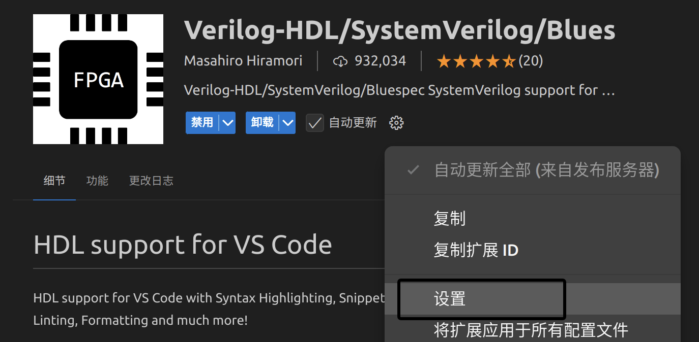

# Verilog插件配置

# 介绍

## 〇、VS Code 插件：[Verilog-HDL/SystemVerilog/Bluespec SystemVerilog](https://marketplace.visualstudio.com/items?itemName=mshr-h.VerilogHDL)

`Verilog-HDL/SystemVerilog/Bluespec SystemVerilog` 是一款 VS Code 插件，旨在为硬件描述语言 (HDL) 的开发提供全面支持。它能够为 Verilog、SystemVerilog、Bluespec SystemVerilog 等 HDL 语言提供语法高亮、代码自动补全、模块实例化、代码格式化等功能。以下是它的一些关键功能和如何使用的详细介绍。

### 核心功能

1. **语法高亮**

   - 支持 Verilog、SystemVerilog、Bluespec SystemVerilog 等 HDL 语言的语法高亮，使代码更易读。

2. **代码补全和模块实例化**

   - 通过集成 Ctags 和其他语言服务器，插件可以提供代码自动补全。

   - 模块实例化，即在输入模块名时可以自动补全端口，省去手动编写端口列表的麻烦。

     （`Ctrl+Shift+P`，输入verilog选择模块）

3. **Linting 支持**

   - 插件支持多种 Linting 工具，能够检查代码中的语法和逻辑错误。包括 Icarus Verilog (`iverilog`)、ModelSim、Verilator、Vivado Logical Simulation (`xvlog`)、Slang、HDL Checker 等。

4. **格式化支持**

   - 提供代码格式化功能，支持 verilog-format、iStyle-verilog-formatter 和 verible-verilog-format。
   - 格式化可以通过设置配置项实现，可以使用不同的格式化风格，使代码风格统一。

5. **Ctags 集成**

   - 插件通过 Ctags 提供符号索引功能，实现代码的自动补全、悬停查看变量声明、转到定义等功能。

6. **模块化扩展功能**

   - 支持自定义 Language Server，例如 svls、Veridian、HDL Checker、Verible Language Server 等。

## 一、[verible](https://github.com/chipsalliance/verible)

### 安装1: [直接下载](https://github.com/chipsalliance/verible/releases)

### 安装2: [源码构建](https://github.com/chipsalliance/verible?tab=readme-ov-file#developers-welcome)

**Verible** 是一套工具集，最常用的是 `verible-verilog-format`，它是 Verilog 和 SystemVerilog 代码的自动格式化工具。

在插件中的作用：

- **代码格式化**：`verible-verilog-format` 可以根据设定的格式规则自动整理 Verilog 或 SystemVerilog 代码。这在团队协作时尤其重要，因为一致的代码风格可以提升代码可读性。
- **格式化配置选项**：用户可以在 VS Code 的配置中指定 `Arguments` ，设置格式化规则，比如缩进宽度、对齐方式、括号和方括号中的空格等。
- **自动格式化**：通过插件，在保存文件时可以触发 `verible-verilog-format` 自动整理代码，或使用快捷键直接格式化整个文件。

## 二、[ctags](https://github.com/universal-ctags/ctags)

`Universal Ctags`

### 安装1: 直接下载 [ctags-nightly-build](https://github.com/universal-ctags/ctags-nightly-build)

### 安装2: [源码构建](https://github.com/universal-ctags/ctags?tab=readme-ov-file#how-to-build-and-install)

**Ctags** 是一种代码分析工具，用于创建代码标签索引，使得编辑器可以快速跳转到函数、模块、变量等符号的定义。`Universal Ctags` 是 Ctags 的改进版本，支持 Verilog 和 SystemVerilog。

在插件中的作用：

- **代码导航**：通过生成 Ctags 索引，插件可以支持 “跳转到定义”和 “查看定义” 的功能。当用户在代码中点击某个信号、模块或变量时，可以快速跳转到它的定义位置。
- **悬停查看信息**：在 Verilog 文件中悬停在信号、模块等上方时，插件会显示该符号的定义信息，帮助理解代码上下文。
- **自动补全**：Ctags 提供的符号信息还可以帮助插件进行自动补全，例如在输入变量或模块名称时自动提示可能的选项。

## 三、Verilator

### 安装 参见重装ysyx

**Verilator** 是 Verilog 的一个高效仿真器，适用于将 Verilog 代码编译为可执行的 C++/SystemC 代码模型，尤其适合大型硬件设计的快速仿真。

在插件中的作用：

- **Linting**：在编码过程中，Verilator 可以作为一个 lint 工具，提供语法检查和静态分析。插件可以调用 Verilator 对 Verilog/SystemVerilog 代码进行实时语法检查，提示潜在错误。
- **仿真和波形生成**：Verilator 可以生成仿真时的波形文件（例如 VCD 文件），插件可以集成 Verilator 的波形生成功能，用于在编写和运行测试时保存信号的变化轨迹，以便在 GTKWave 等波形查看器中查看仿真过程。

# 安装

通过直接下载 GitHub 上的 release 文件来安装工具（如 Ctags 和 Verible）是一种灵活且不依赖包管理器的方法。以下是具体的安装步骤。

## 0. 从 GitHub Release 下载软件

以 Universal Ctags 和 Verible 为例：

- **Universal Ctags** 下载地址：[ctags-nightly-build](https://github.com/universal-ctags/ctags-nightly-build)
- **Verible** 下载地址：[Verible Releases](https://github.com/chipsalliance/verible/releases)

步骤：

## 1. 下载适用的版本

进入相应的 GitHub Release 页面，根据系统和架构选择正确的版本（例如，Linux 的 `.tar.gz`）。

## 2. 解压文件到指定的存放路径

1. 选择一个目录来存放下载的工具。一个好的选择是 `~/software` 或者 `~/tools` 文件夹。如果不存在，可以用以下命令创建：

   ```bash
   mkdir -p ~/software
   ```

2. 将下载的压缩文件解压到该目录：

   ```bash
   # 以 ctags 和 verible 的 tar.gz 文件为例
   tar -xzf ~/Downloads/ctags-<version>.tar.gz -C ~/software/
   tar -xzf ~/Downloads/verible-<version>.tar.gz -C ~/software/
   ```

3. 解压完成后，`~/software/` 目录下应该会有一个包含 `bin` 文件夹的子文件夹（例如 `~/software/ctags-<version>/bin` 和 `~/software/verible-<version>/bin`）。

## 3. 将 `bin` 目录路径添加到 PATH

要让系统识别到这些工具，需要将其 `bin` 路径添加到 `PATH` 环境变量中。

1. **编辑 `~/.bashrc` 文件**（或使用其他 shell 的配置文件，例如 `~/.zshrc`）：

   ```bash
   vim ~/.bashrc
   ```

2. 在文件末尾添加如下内容，将 `<version>` 替换为具体的版本号：

   ```bash
   # 添加 Ctags 和 Verible 到 PATH
   export PATH=$PATH:~/software/ctags-<version>/bin
   export PATH=$PATH:~/software/verible-<version>/bin
   ```

3. **使更改生效**：

   ```bash
   source ~/.bashrc
   ```

## 4. 测试安装是否成功

使用 `which` 命令来确认工具是否已成功添加到 `PATH` 中。

```bash
which ctags
which verible-verilog-format
```

如果安装成功，将显示 Ctags 和 Verible 可执行文件的完整路径，例如：

```bash
/home/username/software/ctags-<version>/bin/ctags
/home/username/software/verible-<version>/bin/verible-verilog-format
```

## 5. 将路径配置到 VS Code 插件中

在 VS Code 的 Verilog-HDL/SystemVerilog 插件中，需要指定 Ctags 和 Verible 格式化工具的路径。

### **打开 VS Code 中本插件的设置**



### 设置 Ctags（用于符号索引和代码导航）

1. 在设置界面中查找 `Verilog Ctags Path`。

2. 在 `Verilog > Ctags: Path` 中填写 `Ctags` 可执行文件的路径(可通过`which`获得)，例如：

   ```
   /home/username/software/ctags-<version>/bin/ctags
   ```

### 设置 Verible（用于代码格式化）

1. 在设置界面中查找 `Verilog Formatting VeribleVerilogFormatter Path`。

2. 在 `Verilog > Formatting > Verible Verilog Formatter: Path` 中填写 `verible-verilog-format` 可执行文件的路径。例如：

   ```
   /home/username/software/verible-<version>bin/verible-verilog-format
   ```

3. 可以在 `Verilog > Formatting > Verible Verilog Formatter: Arguments` 中填写自定义参数，按需配置。

### 配置代码格式化工具

插件支持多个格式化工具，例如 `verible-verilog-format`、`iStyle` 和 `verilog-format`。您可以选择一个自己喜欢的格式化工具：

1. 在设置界面中查找 `Verilog Formatting VerilogHDL Formatter`。
2. 在 `Verilog > Formatting > Verilog HDL: Formatter` 下拉菜单中选择您想使用的格式化工具，例如 `verible-verilog-format`。
3. 选择格式化工具后，确保对应的可执行文件路径已正确配置（如上所述）。

### 设置 Verilator（用于 Lint 检查）

1. 在设置界面中查找 `Verilog Linting Linter`。

2. 在 `Verilog > Linting > Linter` 中选择 Verilator。

3. 在 `Verilog > Linting > Verilator: Arguments` 中，可以添加自定义参数，例如启用所有警告：

   ```
   -Wall
   ```

4. 如果有特定的 include 文件路径，您可以在 `Verilog > Linting > Verilator: Include Path` 中添加。该路径可为绝对路径或相对于工作区的路径。

### 配置完成后测试

1. **测试 Linting 功能**：在 Verilog 文件中编辑内容，确保实时出现语法或逻辑错误提示。
2. **测试格式化功能**：保存 Verilog 文件，查看代码是否按照指定的格式化工具和参数进行了格式化。
3. **测试代码导航功能**：使用 `Ctrl` + 点击变量或模块名称，检查是否能跳转到定义或进行符号查看。

---

[netlistsvg](https://github.com/nturley/netlistsvg) ：draws an SVG schematic from a JSON netlist
