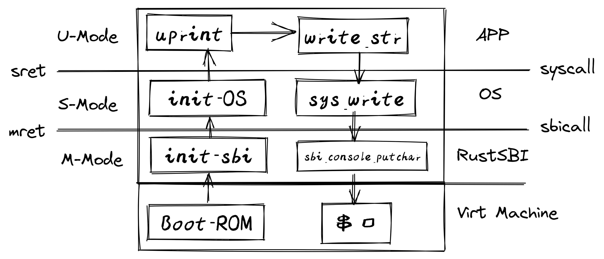

# 【总结笔记】

### 主流CPU架构比较

- **x86和ARM**：由于兼容性和历史原因，这两种架构的设计实现较为复杂。它们的发展历史悠久，以向后兼容性为重，因此积累了大量的指令和特性，这增加了它们的实现复杂度。
- **RISC-V**：与x86和ARM相比，RISC-V架构以其简洁、灵活和可扩展性著称。RISC-V是一个较新的开源指令集架构（ISA），设计时就考虑到了易于学习和使用，特别适合教育和研究，同时也因为其开放性和模块化设计，在工业应用中越来越受欢迎。

### RISC-V系统模式

RISC-V定义了多个系统模式来支持从简单的嵌入式系统到复杂的操作系统和虚拟化环境。这些模式分别是：

- **U-Mode (User/Application Mode)**：最不具特权的模式，用于运行应用程序代码。
- **S-Mode (Supervisor Mode)**：运行操作系统的内核代码，具有一定级别的特权，可以进行一些硬件资源管理。
- **H-Mode (Hypervisor Mode)**：用于运行虚拟机监控器（VMM），比S-Mode拥有更高的特权。
- **M-Mode (Machine Mode)**：最高的特权级别，通常用于运行Bootloader或系统的最底层硬件抽象层。

每个模式都对应于不同的执行环境和特权级别，以及一系列特定的二进制接口（ABI/SBI/HBI）和执行环境（AEE/SEE/HEE），为不同的应用场景提供支持。

### 特权级别和应用场景

- **单应用场景**：只运行一个应用程序，直接在U-Mode下执行。
- **操作系统场景**：引入S-Mode，允许多个应用程序通过操作系统的调度和管理并发运行。
- **虚拟机场景**：通过引入H-Mode，支持在同一硬件上运行多个操作系统实例。
- **应用场景举例**：不同的模式组合可以支持从小型设备到数据中心服务器的广泛应用。

### RISC-V CSR寄存器分类

#### 通用寄存器 (x0-x31)

- 这些是日常编程中最常用的寄存器，用于一般的指令访问。
- 非特权指令可以使用，是最快的存储单元。

#### 控制状态寄存器 (CSR)

- 专为特权指令访问设计，理论上可以有4096个。
- 用户态应用程序受限，无法访问大部分CSR寄存器。
- 操作系统（内核态）通过CSR寄存器控制计算机，实现了对硬件细节的精确控制和管理。

### 通过CSR寄存器实现的隔离

操作系统通过设置CSR寄存器实现对资源的隔离，保护系统的安全可靠：

- **权力隔离**：限制应用访问关键系统寄存器，如地址空间配置寄存器。
- **时间隔离**：防止应用长时间占用CPU，如中断配置寄存器。
- **数据隔离**：防止应用程序破坏或窃取数据，如地址空间相关寄存器。

### CSR寄存器功能

CSR寄存器包括信息类（如芯片ID、CPU核ID等信息），Trap设置（设置中断和异常相关寄存器），Trap处理（处理中断和异常相关寄存器），内存保护（保护内存资源）等多种功能，强化了RISC-V的安全性和灵活性。

### 系统编程

系统编程涉及深入理解处理器的特权级架构，熟悉各特权级能够访问的寄存器、内存和外设资源。这包括编写内核级代码，实现内存管理、进程调度、异常处理、中断处理、系统调用和外设控制等核心功能。

### RISC-V中的U-Mode编程

用户态编程（U-Mode）依赖于系统调用（通过执行`ecall`指令触发）从操作系统获取服务，如屏幕打印或文件读取。

### RISC-V中的M-Mode编程

机器模式（M-Mode）是RISC-V中最高权限模式，主要负责拦截和处理中断/异常。M-Mode下的程序拥有对系统底层功能的完全控制权，这包括同步异常处理和异步中断处理。

### M-Mode中断的硬件响应

当发生中断/异常时，处理器执行以下步骤：

1. **保存当前PC**到`mepc`，然后设置PC到`mtvec`指定的中断处理例程入口地址。
2. 设置`mcause`以指示中断/异常的类型，并设置`mtval`为出错地址或其他信息。
3. **禁用中断**，通过将`mstatus`中的MIE位置零，并保留先前的MIE值到MPIE中。
4. **保留发生异常之前的权限模式**到`mstatus`的MPP域中，并更改权限模式为M。

### 中断/异常处理的控制权移交

#### M-Mode中断/异常处理的控制权移交

RISC-V提供的中断/异常委托机制允许选择性地将特定的中断和异常处理委托给S-Mode，绕过M-Mode，从而加速处理速度。`mideleg`和`medeleg`寄存器用于控制这一委托过程，每个位代表一种中断或异常，设置相应的位即可将处理委托给S-Mode。

#### 为何需要控制权移交

控制权的移交机制使得操作系统（运行在S-Mode）能够更加灵活地管理中断和异常，提高系统的响应速度和效率。此外，这也是一种安全策略，允许操作系统处理大部分中断和异常，而仅在必要时才使用更高权限的M-Mode。

### RISC-V系统编程：内核编程

#### S-Mode中断控制和状态寄存器

S-Mode具有一套自己的中断控制和状态寄存器，如`stvec`、`sepc`、`scause`、`sie`、`sip`、`stval`、`sscratch`和`sstatus`，它们与M-Mode的类似寄存器相对应，但用于管理S-Mode下的中断和异常。

#### S-Mode中断/异常的硬件响应

当S-Mode接收到一个中断或异常时，处理器自动执行一系列操作，包括保存当前程序计数器（PC）到`sepc`，将中断或异常类型记录到`scause`，并跳转到`stvec`指定的处理程序地址。

#### S-Mode中断/异常的软件处理

软件方面，需要初始化中断和异常处理程序，并设置`stvec`寄存器指向这些程序。在中断或异常发生时，处理器跳转到这些程序执行相应的处理逻辑，然后返回到原来的执行流程。

#### S-Mode虚存机制

S-Mode支持基于页表的虚拟内存系统，通过`satp`寄存器控制，实现虚拟地址到物理地址的映射和转换。这一机制为操作系统提供了强大的内存管理能力，包括进程间的地址空间隔离和内存保护。

---

**lzz**

以上的知识点感觉比较虚幻全是各种定义 有没有什么加深理解的介绍

**ChatGPT**

理解RISC-V的中断、异常处理和虚存机制确实需要把握很多概念和细节。让我们尝试通过一些具体的场景和比喻来加深理解。

### 中断/异常处理

想象你在一个大型公司工作，每个员工（程序）都在各自的办公室（内存空间）里忙碌。突然，火警（中断）响起，大家需要按照既定的紧急疏散程序（中断服务例程）迅速撤离。这个疏散计划就像是`mtvec`或`stvec`寄存器，它告诉大家在紧急情况下应该去哪里集合。

- **M-Mode中断处理**：想象公司的保安部门（M-Mode）负责处理所有紧急情况。他们有权利决定是自己处理还是指派给各楼层的安全代表（S-Mode）。
- **S-Mode中断处理**：楼层的安全代表只负责自己楼层的紧急情况。如果有更大的紧急情况，他们会联系保安部门。

### 中断/异常的控制权移交

当保安部门决定让楼层的安全代表处理某些类型的紧急情况时，这就像是通过`mideleg`和`medeleg`寄存器将中断和异常处理的控制权委托给S-Mode。

### 虚拟内存系统

虚拟内存系统可以比作一家大型图书馆，每本书（数据/指令）都有一个特定的位置（物理地址）。但是，图书馆为了方便访问和管理，使用了一个索引系统（页表），让读者（程序）通过索引号（虚拟地址）就能找到书籍的实际位置。`satp`寄存器就是这个索引系统的入口，告诉你如何通过虚拟地址找到数据的物理地址。

- **地址转换**：当你查找一本书时，你只需知道它的索引号。图书馆的管理系统（MMU）会自动通过索引号查找到书的实际位置，这个过程就像虚拟地址被转换为物理地址。

### 实际应用

- **开发调试**：使用断点和单步执行来调试程序，就像是在图书馆里找书时偶尔需要停下来检查你是否走在正确的路径上。
- **操作系统设计**：操作系统的设计者就像图书馆的管理员，需要规划索引系统，决定哪些书籍（数据/程序）应该放在哪里，以及如何高效地管理这些资源。

通过这些场景和比喻，希望能帮你更直观地理解RISC-V的这些概念。在实践中，通过编写和运行一些简单的RISC-V程序，尤其是那些涉及中断处理和内存管理的程序，将进一步加深你对这些概念的理解。

---

**lzz**

解释总结以上使用的寄存器的名字、缩写的英文和功能职责，展示它们一定的工作流程

**ChatGPT**

让我们详细总结一下之前讨论的RISC-V中的重要寄存器及其在中断/异常处理和虚拟内存系统中的职责。

### 中断/异常处理寄存器

1. **PC (Program Counter)**: 程序计数器，保存着处理器当前执行指令的地址。
2. **mepc (Machine Exception Program Counter)**: 机器异常程序计数器，保存发生异常时指令的地址。在M-Mode中用于记录中断或异常发生前的PC值。
3. **sepc (Supervisor Exception Program Counter)**: 监管者异常程序计数器，与mepc相似，但用于S-Mode。记录发生异常或中断时的PC值。
4. **mtvec (Machine Trap-Vector Base-Address Register)**: 机器陷阱向量基址寄存器，存储M-Mode中断处理程序的入口地址。
5. **stvec (Supervisor Trap-Vector Base-Address Register)**: 监管者陷阱向量基址寄存器，存储S-Mode中断处理程序的入口地址。
6. **mcause (Machine Cause Register)**: 机器原因寄存器，记录最近一次异常或中断的原因。
7. **scause (Supervisor Cause Register)**: 监管者原因寄存器，与mcause类似，但用于S-Mode。
8. **mie (Machine Interrupt Enable)**: 机器中断使能寄存器，M-Mode中断使能寄存器，用于控制是否允许中断发生。
9. **sie (Supervisor Interrupt Enable)**: 监管者中断使能寄存器，S-Mode中断使能寄存器，与mie相似，但用于S-Mode。
10. **mideleg (Machine Interrupt Delegation Register)**: 机器中断委托寄存器，控制哪些中断可以被委托给S-Mode处理的M-Mode寄存器。
11. **medeleg (Machine Exception Delegation Register)**: 机器异常委托寄存器，控制哪些异常可以被委托给S-Mode处理的M-Mode寄存器。

### 虚拟内存系统寄存器

1. **satp (Supervisor Address Translation and Protection)**: S-Mode下控制页表的寄存器，包括启用分页机制、页表的物理地址和地址空间标识符。

### 工作流程示例

以下是一个简化的中断处理流程：

1. **中断发生**：假设CPU正在执行用户程序，此时发生了一个时钟中断。
2. 保存现场：
   - CPU自动将当前的PC值保存到`mepc`或`sepc`（取决于当前的模式和委托设置）。
   - `mcause`/`scause`被设置为描述中断原因的值。
3. 中断处理：
   - CPU读取`mtvec`/`stvec`的值，跳转到中断处理程序的入口地址。
   - 中断处理程序执行，例如，可能更新系统时钟，调度另一个进程等。
4. 恢复现场并返回：
   - 处理完成后，中断处理程序通过指令`mret`/`sret`指示CPU从`mepc`/`sepc`读取之前保存的PC值，恢复到中断发生前的执行点。

在虚拟内存系统中的地址转换过程：

1. **程序访问虚拟地址**：用户程序试图访问一个虚拟地址。
2. 地址转换：
   - CPU使用`satp`寄存器中的信息找到根页表。
   - 根据虚拟地址中的页号和偏移量，通过一系列页表项遍历找到最终的物理地址。
3. **访问物理内存**：CPU根据转换后的物理地址访问实际的内存数据或指令。

通过这些寄存器和工作流程，RISC-V能够有效地处理中断和异常，同时提供灵活的内存管理机制。

---

| 寄存器缩写 | 英文全称                                     | 中文全称                 | 功能描述                                                     |
| ---------- | -------------------------------------------- | ------------------------ | ------------------------------------------------------------ |
| PC         | Program Counter                              | 程序计数器               | 保存着处理器当前执行指令的地址。                             |
| mepc       | Machine Exception Program Counter            | 机器异常程序计数器       | 保存发生异常时指令的地址，在M-Mode中用于记录中断或异常发生前的PC值。 |
| sepc       | Supervisor Exception Program Counter         | 监管者异常程序计数器     | 与mepc相似，但用于S-Mode，记录发生异常或中断时的PC值。       |
| mtvec      | Machine Trap-Vector Base-Address Register    | 机器陷阱向量基址寄存器   | 存储M-Mode中断处理程序的入口地址。                           |
| stvec      | Supervisor Trap-Vector Base-Address Register | 监管者陷阱向量基址寄存器 | 存储S-Mode中断处理程序的入口地址。                           |
| mcause     | Machine Cause Register                       | 机器原因寄存器           | 记录最近一次异常或中断的原因。                               |
| scause     | Supervisor Cause Register                    | 监管者原因寄存器         | 与mcause类似，但用于S-Mode。                                 |
| mie        | Machine Interrupt Enable                     | 机器中断使能寄存器       | M-Mode中断使能寄存器，用于控制是否允许中断发生。             |
| sie        | Supervisor Interrupt Enable                  | 监管者中断使能寄存器     | S-Mode中断使能寄存器，与mie相似，但用于S-Mode。              |
| mideleg    | Machine Interrupt Delegation Register        | 机器中断委托寄存器       | 控制哪些中断可以被委托给S-Mode处理的M-Mode寄存器。           |
| medeleg    | Machine Exception Delegation Register        | 机器异常委托寄存器       | 控制哪些异常可以被委托给S-Mode处理的M-Mode寄存器。           |

---

### RISC-V中断处理流程

1. **中断触发**：首先，中断信号由硬件（如定时器、I/O设备）发出。
2. **中断识别**：处理器检测到中断信号，并根据当前的中断使能状态（通过`mie`或`sie`寄存器控制）和优先级决定是否接受中断。
3. **保存当前状态**：
   - **保存PC**：处理器自动将当前的程序计数器（PC）保存到`mepc`（如果在M-Mode）或`sepc`（如果中断被委托给S-Mode）寄存器中。
   - **设置`mcause`/`scause`**：`mcause`（在M-Mode）或`scause`（在S-Mode）寄存器被设置为描述中断原因的值。
4. **中断处理程序入口**：
   - **跳转执行**：处理器读取`mtvec`（在M-Mode）或`stvec`（在S-Mode）寄存器的值，并跳转到相应的中断处理程序入口地址执行。
5. **执行中断处理程序**：执行中断服务例程（ISR），完成必要的处理任务，如读取数据、更新状态、清除中断标志等。
6. **恢复现场并返回**：
   - 通过执行`mret`（在M-Mode）或`sret`（在S-Mode）指令，处理器从`mepc`/`sepc`寄存器恢复之前保存的PC值，返回到中断发生前的执行点继续执行。

---

RISC-V的启动流程中，不同的模式（U-Mode、S-Mode、M-Mode）以及它们之间的交互反映了一个层级结构和控制流程。这个流程确保了系统在启动和运行时的安全和稳定性。

### 从下到上（启动和初始化流程）

1. **启动（Boot-ROM）**：
   - 系统电源开启或重置后，首先执行的是ROM中的启动代码，它初始化硬件，并跳转到更高级别的程序或者引导加载器。
2. **机器模式（M-Mode）**：
   - 接下来，控制权传递到机器模式，这是最低级别的权限模式。在这里，通常执行的是固件代码，如RustSBI（Supervisor Binary Interface的一个实现），负责初始化系统的基础设施，包括设置中断和异常处理程序。
3. **监管模式（S-Mode）**：
   - 一旦机器模式的初始化完成，通过`mret`指令将控制权交给监管模式。监管模式负责启动操作系统，设置虚拟内存、进程和用户模式的隔离。
4. **用户模式（U-Mode）**：
   - 操作系统创建用户空间环境，并通过`sret`指令跳转到用户模式运行用户程序。用户模式程序可以通过系统调用与操作系统交互，请求服务。

### 从上到下（系统调用和响应流程）

1. **用户模式（U-Mode）**：
   - 当用户程序需要操作系统服务时（比如写文件、网络通信等），它会通过系统调用（syscall）请求操作系统介入。
2. **监管模式（S-Mode）**：
   - 系统调用触发中断，将控制权从用户模式转交给监管模式。操作系统在监管模式中响应系统调用，执行必要的服务。
3. **机器模式（M-Mode）**：
   - 若需要执行更低级别的操作，如控制台输入输出，操作系统可能会通过SBI调用（sbicall），请求机器模式下的SBI固件提供支持。

### 从下到上（执行SBI调用并从M-Mode返回到U-Mode）

1. **M-Mode执行SBI调用**:
   - 在机器模式下，RustSBI等固件执行一个特权级操作，如`sbicall`进行系统级别的服务请求。
2. **M-Mode完成操作**:
   - SBI服务完成后，例如完成了控制台字符输出或硬件设备的控制。
3. **返回到S-Mode**:
   - 使用`mret`指令，RustSBI将控制权从M-Mode返回到S-Mode。此时，处理器状态恢复到S-Mode执行`sbicall`之前的状态。
4. **S-Mode处理结果**:
   - 操作系统在S-Mode处理`sbicall`的结果，可能是更新操作系统状态、记录日志或者准备返回到用户模式。
5. **准备返回到U-Mode**:
   - 操作系统完成所有必要的处理后，准备将控制权返回给用户程序。
6. **返回到U-Mode**:
   - 操作系统使用`sret`指令，将控制权返回到用户模式，继续用户程序的执行。
7. **U-Mode继续执行**:
   - 用户程序继续执行，可能是处理SBI调用的结果，或者执行下一步操作。
8. **用户程序运行结束**:
   - 用户程序完成其任务后，可能是自然结束，或者因为需要再次服务而触发另一次系统调用。

在整个流程中，`mret`和`sret`指令用于返回到之前的权限模式，它们分别用在机器模式和监管模式的退出操作。这样的层级结构和控制流程允许RISC-V系统在保证安全性的同时，实现复杂的操作系统功能，包括用户与硬件之间的交互。

### 从上到下（关机流程）

1. **用户模式（U-Mode）**:
   - 用户程序决定关机，发起系统调用（syscall）通知操作系统进行关机。
2. **监管模式（S-Mode）**:
   - 操作系统接收到来自用户程序的关机系统调用，并开始执行关机准备工作，如关闭文件、通知其他进程等。
3. **机器模式（M-Mode）**:
   - 操作系统执行完所有准备工作后，通过SBI调用（sbicall）请求M-Mode的固件执行关机操作。
4. **执行SBI关机调用**:
   - 固件（如RustSBI）接收到关机请求，执行必要的硬件关闭程序，包括停止时钟、关闭I/O设备等。
5. **电源关闭（Power Down）**:
   - 完成所有硬件关闭程序后，固件执行最终的电源关闭操作。

---

### 用户程序执行“Hello World”

1. **执行用户程序**:
   - 用户程序（在U-Mode中）开始执行，当需要打印输出时，会执行如`uprint`这样的打印函数。
2. **系统调用**:
   - 执行`uprint`函数时，用户程序会进行系统调用（通过`ecall`指令），请求操作系统提供打印服务。
3. **S-Mode响应系统调用**:
   - 系统调用将控制权从U-Mode转交给S-Mode，操作系统的`sys_write`函数响应系统调用，处理打印请求。
4. **调用SBI服务**:
   - 如果打印需要低级访问，如向控制台输出字符，操作系统可能会调用SBI服务（通过SBI调用）。
5. **M-Mode SBI执行打印**:
   - SBI的`sbi.console_putchar`函数在M-Mode中被调用，将字符输出到控制台。

### 返回监管模式（S-Mode）

1. **SBI to OS**:
   - 打印操作完成后，SBI固件通过`mret`指令返回到监管模式，准备返回控制权给操作系统。
2. **OS处理完成**:
   - 操作系统接收来自SBI的返回，并完成任何后续的清理或状态更新操作。

### 返回用户模式（U-Mode）

1. **返回到系统调用点**:
   - 操作系统通过`sret`指令将控制权返回到发起系统调用的用户程序的位置。
2. **用户程序继续执行**:
   - 用户程序继续执行打印“Hello World”后的下一条指令。
3. **程序执行完毕**:
   - “Hello World”打印请求执行完毕后，用户程序可能会继续执行其他任务或者终止。

### 系统返回到正常状态

1. **任务调度（可选）**:

   - 如果有多任务调度，操作系统可能在此时进行上下文切换，调度另一个进程或线程运行。

2. **系统空闲或等待**:

   - 如果用户程序是最后一个任务或系统处于空闲状态，操作系统可能会进入等待状态，等待下一个中断或系统调用。

   ---

在RISC-V架构中，用户态（U-Mode）是不允许直接执行特权指令的。如果用户程序尝试执行特权指令，这将触发一个异常，进而由更高权限模式的异常处理程序来响应。以下是在用户态执行特权指令时的流程：

1. **用户模式（U-Mode）执行特权指令**:
   - 用户程序试图执行特权指令（例如：`uprint`内部尝试直接执行硬件操作）。
2. **异常被触发**:
   - 由于用户程序无权执行特权指令，处理器将触发异常。
3. **转到监管模式（S-Mode）**:
   - 异常使处理器从U-Mode跳转到S-Mode，控制权转交给操作系统的异常处理程序（trap handler）。
4. **操作系统处理异常**:
   - 操作系统的异常处理程序确定异常原因（通过`scause`寄存器）并决定如何处理（比如记录错误、终止程序等）。
5. **可选的SBI调用**:
   - 如果需要，操作系统可以选择调用SBI接口（例如：`sbi_exit`），请求M-Mode下的SBI来执行某些操作（比如关闭硬件设备或重启）。
6. **恢复或终止**:
   - 根据异常的性质和严重性，操作系统可能会决定继续执行应用程序、重新启动应用程序或完全终止应用程序。
7. **返回用户模式（U-Mode）**:
   - 如果操作系统决定让应用程序继续运行，它将通过执行`sret`指令返回到用户模式。
8. **处理完成**:
   - 用户程序根据操作系统的处理结果决定下一步操作，可能是继续执行、尝试其他操作或正常退出。

在这个流程中，异常处理程序为系统的稳定性提供了关键保障，确保即使在不当操作尝试时，系统也能保持响应性和可靠性。这也显示了RISC-V架构对权限控制的严格性，防止了非授权的特权操作。

---

RISC-V架构中的中断处理和权限模式为系统设计提供了一系列的优点，这些优点在上述的“Hello World”程序执行流程和关机流程中表现得尤为明显：

1. **层级安全性**：通过层级化的权限模式（U-Mode, S-Mode, M-Mode），RISC-V确保了每个层级只能执行它被授权的操作。这防止了低权限代码对系统的潜在破坏，提高了系统的整体安全性。
2. **细粒度控制**：通过各种模式特定的寄存器和指令（如`mepc`, `sepc`, `mcause`, `scause`, `mret`, `sret`），系统可以精确控制执行流程和资源管理，从而在需要时提供灵活性。
3. **异常处理**：当用户态程序尝试执行非法操作时（如特权指令），RISC-V能够优雅地捕获并处理异常，而不是让整个系统崩溃。
4. **中断效率**：通过委托机制（`mideleg` 和 `medeleg`），RISC-V允许中断直接被S-Mode处理，而无需每次都经过M-Mode，这减少了中断响应时间，提高了效率。
5. **模块化设计**：RISC-V的设计鼓励模块化，这意味着不同的组件（比如SBI）可以独立于处理器核心进行开发和优化。
6. **简化的上下文切换**：在中断处理和系统调用过程中，通过寄存器保存和恢复现场，RISC-V简化了上下文切换，减少了切换开销。
7. **可预测的行为**：每个级别的行为都是可预测的，这对于系统的可靠性和可维护性至关重要。在关机流程中，这一点尤其显著，因为系统需要按照严格的顺序逐步关闭资源。
8. **支持虚拟化**：通过`satp`寄存器和虚存机制的支持，RISC-V允许操作系统实现强大的内存管理策略，为虚拟化和容器化技术提供了基础。
9. **底层支持**：底层的SBI提供了一个通用的接口，让上层操作系统能够与硬件进行互动，而不需要关心硬件的具体实现细节，促进了软硬件之间的解耦。

总的来说，通过这些设计，RISC-V架构提供了一个强大、安全和高效的平台，适用于从简单的嵌入式系统到复杂的操作系统和应用程序。它的设计允许系统开发者在确保核心功能安全性的同时，为最终用户提供灵活、快速响应的体验。
