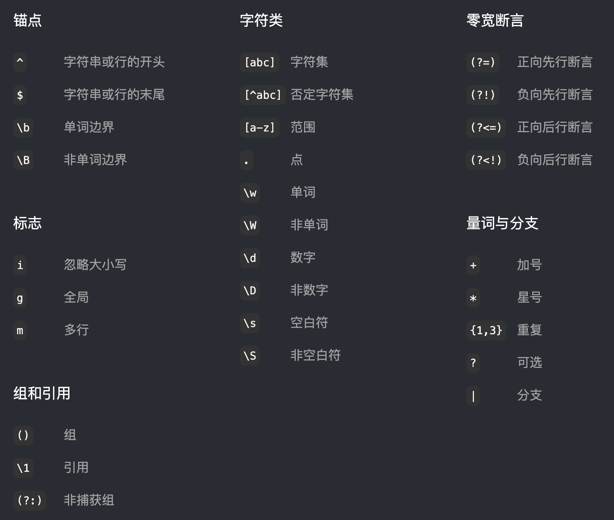

## 正则表达式符号详解

上图（来着 [RegexLearn](https://regexlearn.com/zh-cn/cheatsheet) ）展示了常用正则表达式的符号和规则，它们可以用来匹配、检索或操作文本中的特定模式。

你可以通过[RegexOne](https://regexone.com/)、[RegexLearn](https://regexlearn.com/zh-cn)来练习它们。

    <iframe src="https://regexlearn.com/zh-cn/cheatsheet" frameborder="0" allowfullscreen></iframe>
    

        <a href="https://regexlearn.com/zh-cn/cheatsheet" target="_blank">点击此处打开</a>
    
 <!-- 新的遮罩层放在iframe底部1/4区域 -->

以下将对这些符号进行详细解释，包括它们的作用和实际应用。

### 1. 锚点
- **^**：匹配字符串或行的开头。  
  **示例**：`^abc`匹配以`abc`开头的字符串。
  
- **$**：匹配字符串或行的末尾。  
  **示例**：`abc$`匹配以`abc`结尾的字符串。
  
- **\b**：匹配单词边界，即单词的开头或结尾。  
  **示例**：`\bword\b`只匹配独立的单词`word`。

- **\B**：匹配非单词边界，即不在单词的开头或结尾。  
  **示例**：`\Bword\B`匹配包含在其他字符或单词中的`word`。

### 2. 字符类
- **[abc]**：字符集，匹配括号内的任意一个字符。  
  **示例**：`[abc]`匹配`a`、`b`或`c`中的任意一个。

- **[^abc]**：否定字符集，匹配不在括号内的任何字符。  
  **示例**：`[^abc]`匹配除`a`、`b`、`c`之外的所有字符。

- **[a-z]**：范围，匹配指定范围内的任意字符。  
  **示例**：`[a-z]`匹配所有小写字母。

- **.（点号）**：匹配除换行符外的任意一个字符。  
  **示例**：`.`匹配任意字符，如`a`、`1`等。

- **\w**：匹配任意字母、数字或下划线（等价于`[A-Za-z0-9_]`）。  
  **示例**：`\w`匹配单词字符。

- **\W**：匹配任意非字母、数字或下划线的字符。  
  **示例**：`\W`匹配非单词字符。

- **\d**：匹配数字（等价于`[0-9]`）。  
  **示例**：`\d`匹配数字字符。

- **\D**：匹配非数字字符。  
  **示例**：`\D`匹配任意非数字字符。

- **\s**：匹配空白符，包括空格、制表符、换行符等。  
  **示例**：`\s`匹配空白字符。

- **\S**：匹配非空白符。  
  **示例**：`\S`匹配非空白字符。

### 3. 零宽断言
- **(?=...)**：正向先行断言，匹配某个位置，且该位置后面的字符满足括号内的条件。  
  **示例**：`a(?=b)`匹配`a`，但前提是后面紧跟一个`b`。

- **(?!...)**：负向先行断言，匹配某个位置，且该位置后面的字符不满足括号内的条件。  
  **示例**：`a(?!b)`匹配`a`，但后面不能有`b`。

- **(?<=...)**：正向后行断言，匹配某个位置，且该位置前面的字符满足括号内的条件。  
  **示例**：`(?<=a)b`匹配`b`，前提是前面紧跟一个`a`。

- **(?<!...)**：负向后行断言，匹配某个位置，且该位置前面的字符不满足括号内的条件。  
  **示例**：`(?<!a)b`匹配`b`，但前面不能有`a`。

### 4. 量词与分支
- **+**：匹配前面的字符或子表达式一次或多次。  
  **示例**：`a+`匹配一个或多个连续的`a`。

- **\***：匹配前面的字符或子表达式零次或多次。  
  **示例**：`a*`匹配零个或多个连续的`a`。

- **{n,m}**：匹配前面的字符或子表达式至少`n`次，至多`m`次。  
  **示例**：`a{1,3}`匹配`1`到`3`个连续的`a`。

- **?**：匹配前面的字符或子表达式零次或一次。  
  **示例**：`a?`匹配零个或一个`a`。

- **|**：分支，表示"或"的关系。  
  **示例**：`a|b`匹配`a`或`b`中的一个。

### 5. 标志
- **i**：忽略大小写。  
  **示例**：`/abc/i`会匹配`abc`、`ABC`等。

- **g**：全局匹配，即匹配所有符合条件的部分，而不仅是第一个。  
  **示例**：`/a/g`会匹配所有`a`字符。

- **m**：多行模式，`^`和`$`可以匹配行的开头和结尾。  
  **示例**：`/abc$/m`在多行模式下可以匹配每一行以`abc`结尾的情况。

### 6. 组和引用
- **()**：用于分组，可以把多个字符或表达式作为一个整体。  
  **示例**：`(abc)`将`abc`视为一个组。

- **\1**：引用前面的分组。  
  **示例**：`(a)\1`匹配两个连续的`a`。

- **(?:)**：非捕获组，不存储匹配结果。  
  **示例**：`(?:abc)`仅用于匹配，不保存匹配内容。

