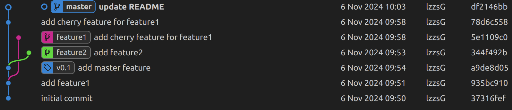

# 版本控制(Git)

Complete later

可参见[missing-semester: 版本控制(Git)](https://missing-semester-cn.github.io/2020/version-control/)

可使用[Learn Git Branching](https://learngitbranching.js.org/)练习

<div class="iframe-wrapper">
    <iframe src="https://learngitbranching.js.org/?locale=zh_CN" frameborder="0" allowfullscreen></iframe>
    <div class="iframe-overlay-quarter-b">
        <a href="https://learngitbranching.js.org/?locale=zh_CN" target="_blank">点击此处打开</a>
    </div> <!-- 新的遮罩层放在iframe底部1/4区域 -->
</div>

---

## Git 基础指导

### 1. Git 初始操作

- **`git init`**：在当前目录中初始化一个新的 Git 仓库，开始版本控制。
- **`git add <file>`**：将文件加入暂存区，准备提交。
- **`git commit -m "message"`**：提交暂存区内容到仓库，附带提交说明。
- **`git status`**：查看当前仓库状态，显示未提交的更改。
- **`git log`**：查看提交历史，显示提交者、时间、提交信息。

### 2. 分支管理

- **`git branch <branch_name>`**：创建新分支，分支是开发线的独立副本。
- **`git checkout <branch>`**：切换到指定分支，开始在该分支上工作。
- **`git merge <branch>`**：将指定分支的更改合并到当前分支。

### 3. 查看与撤销操作

- **`git diff`**：查看工作区中尚未暂存的更改。
- **`git reset <file>`**：从暂存区移除文件，但保留工作区更改。
- **`git rm <file>`**：从工作区与 Git 仓库中删除文件。

### 4. 远程仓库

- **`git remote add <name> <url>`**：将远程仓库关联到本地项目。
- **`git clone <url>`**：克隆远程仓库到本地。
- **`git pull`**：从远程仓库拉取最新代码并与当前分支合并。
- **`git push`**：将本地更改推送到远程仓库。

## Git 进阶操作指导

### 1. 分支管理与操作

- **`git branch -d <branch>`**：删除已合并的分支。
- **`git stash`**：暂存当前未提交的修改，允许在切换分支时保存工作进度。
- **`git rebase <branch>`**：将指定分支的更改应用于当前分支，保持提交历史整洁。
- **`git cherry-pick <commit>`**：将其他分支的某个提交应用到当前分支。

### 2. 历史管理与回退

- **`git reset --hard <commit>`**：彻底回退到指定提交，放弃后续更改。
- **`git revert <commit>`**：生成一个新的提交，撤销指定提交的更改。

### 3. 远程操作

- **`git fetch`**：从远程仓库获取最新的变更，但不合并。
- **`git push -u <remote> <branch>`**：推送当前分支到远程仓库，并设置跟踪。

### 4. 标签管理

- **`git tag <tag_name>`**：创建标签，常用于标记发布版本。
- **`git push origin <tag_name>`**：推送本地标签到远程仓库。

### 5. 合并冲突与解决

- **合并冲突**：在合并分支时，如果 Git 检测到两个分支修改相同文件的同一部分，将发生冲突。手动编辑冲突部分后，使用 `git add <file>` 解决冲突，然后完成合并。

### 6. 子模块

- **`git submodule add <url>`**：将其他 Git 仓库作为子模块添加到当前项目。
- **`git submodule update --init`**：初始化并更新子模块内容。

### 7. 交互式 rebase

- **`git rebase -i <commit>`**：交互式 rebase 允许你在回顾历史时修改、合并提交、修改提交信息等操作，便于整理历史。

### 8. 清理与优化

- **`git clean -f`**：删除未追踪的文件。
- **`git gc`**：运行垃圾回收，优化 Git 仓库的存储。

## 更多 Git 常用操作

### 1. 重写提交历史

- **`git commit --amend`**：修改最近一次的提交信息或附加更改。
- **`git rebase -i HEAD~n`**：交互式重写最近 n 次提交（修改、合并或删除历史）。

### 2. 远程仓库操作进阶

- **`git remote set-url <name> <new-url>`**：修改现有远程仓库的 URL。
- **`git pull --rebase`**：拉取远程更改并在本地提交的基础上重放。

### 3. 解决冲突

- **`git mergetool`**：使用图形化或命令行工具解决冲突。
  
### 4. 查看提交详细信息

- **`git blame <file>`**：逐行查看文件的更改历史，了解每行代码是谁、何时修改的。
- **`git show <commit>`**：查看特定提交的详细信息。

### 5. Git 别名

- **`git config --global alias.co checkout`**：创建 `git co` 作为 `git checkout` 的简写，方便使用。

### 6. 恢复误删的分支

- **`git reflog`**：查看最近所有 HEAD 的移动记录，可以从中找到删除的分支。
- **`git checkout -b <branch_name> <commit>`**：基于 reflog 中找到的提交，恢复误删分支。

---

## Git 实践练习

下面是一份练习 Git 的流程，你可以在一个新的文件夹中练习 Git 的各种基本操作，包括创建文件、分支管理、提交、打标签、变基、cherry-pick 等。

在练习 Git 操作时，实时查看分支和提交历史的情况非常有助于理解分支的结构。你可以使用一些 Git 可视化工具，例如 `git graph` 插件（在 VS Code 等编辑器中很常用），或者使用 Git 的自带命令来简化视图：

```bash
git log --oneline --graph --all --decorate
```

通过该命令，你可以在终端中以图形化方式查看分支结构、提交历史以及标签等信息，便于理解不同分支之间的合并和变基情况。


`git graph` 插件

### 1. 初始化项目和设置 Git 仓库

#### 新建文件夹并初始化 Git 仓库

```bash
mkdir git_practice              # 创建文件夹
cd git_practice                  # 进入文件夹
git init                         # 初始化 Git 仓库
```

#### 配置用户名和邮箱

确保在全局或本地配置 Git 用户信息。

```bash
git config --global user.name "Your Name"
git config --global user.email "your.email@example.com"
```

### 2. 创建初始文件并提交

#### 创建文件并进行第一次提交

```bash
echo "# Git Practice Project" > README.md   # 创建 README 文件
mkdir src                                   # 创建 src 文件夹
echo "print('Hello, World!')" > src/main.py # 创建 main.py 文件
```

#### 添加并提交文件

```bash
git add README.md src/main.py               # 添加文件到暂存区
git commit -m "Initial commit with README and main.py"   # 提交文件
```

### 3. 创建并切换分支

#### 创建新分支 `feature1` 并切换到该分支

```bash
git branch feature1             # 创建 feature1 分支
git checkout feature1           # 切换到 feature1 分支
# 或者使用更简洁的方式
git checkout -b feature1        # 创建并切换到 feature1 分支
```

#### 在 `feature1` 分支上创建新文件并提交

```bash
echo "def feature1():\n    return 'This is feature 1'" > src/feature1.py
git add src/feature1.py
git commit -m "Add feature1.py with feature1 function"
```

### 4. 合并分支

#### 切换回 `main` 分支并合并 `feature1`

```bash
git checkout main                # 切换回 main 分支
git merge feature1               # 合并 feature1 分支
```

#### 查看合并结果

```bash
git log --oneline --graph        # 查看提交历史
```

### 5. 使用 `rebase` 进行变基

#### 创建 `feature2` 分支并进行修改

```bash
git checkout -b feature2         # 创建并切换到 feature2 分支
echo "def feature2():\n    return 'This is feature 2'" > src/feature2.py
git add src/feature2.py
git commit -m "Add feature2.py with feature2 function"
```

#### 切换到 `main` 分支并更新内容

在 `main` 分支上创建一个新文件并提交，模拟代码库的进展。

```bash
git checkout main
echo "print('Additional setup for main branch')" > setup.py
git add setup.py
git commit -m "Add setup.py for main branch setup"
```

#### 切换回 `feature2` 分支并进行变基

将 `feature2` 的修改基于 `main` 的最新提交重新排列。

```bash
git checkout feature2
git rebase main
```

### 6. 打标签

#### 在 `main` 分支上创建标签

创建一个版本标签 `v1.0`，用于标记发布点。

```bash
git checkout main
git tag -a v1.0 -m "Release version 1.0"
```

#### 查看标签

```bash
git tag                         # 列出所有标签
git show v1.0                   # 查看标签 v1.0 的详细信息
```

### 7. 使用 `cherry-pick` 选择性地应用提交

假设我们想将 `feature1` 分支的某个提交 cherry-pick 到 `main` 分支上。

#### 创建一个新的提交并查看提交 ID

在 `feature1` 分支上创建一个新文件 `src/feature1_extra.py`。

```bash
git checkout feature1
echo "def extra_feature():\n    return 'Extra feature'" > src/feature1_extra.py
git add src/feature1_extra.py
git commit -m "Add extra feature for feature1"
git log --oneline               # 记下该提交的 ID（假设为 abc1234）
```

#### 切换到 `main` 分支并 cherry-pick

```bash
git checkout main
git cherry-pick abc1234         # 将刚才记下的提交应用到 main 分支
```

### 8. 查看提交历史和分支图

为了清晰地查看各个提交和分支之间的关系，可以使用以下命令查看分支图。

```bash
git log --oneline --graph --all --decorate
```

### 9. 推送到远程仓库

如果你有一个远程仓库，可以将本地分支和标签推送到远程。

#### 添加远程仓库并推送

```bash
git remote add origin https://github.com/yourusername/git_practice.git
git push -u origin main         # 推送 main 分支到远程
git push -u origin feature1     # 推送 feature1 分支到远程
git push --tags                 # 推送所有标签
```

### 10. 清理本地和远程分支

当某些分支已经合并且不再需要，可以删除它们。

#### 删除本地分支

```bash
git branch -d feature1          # 删除已合并的 feature1 分支
```

#### 删除远程分支

```bash
git push origin --delete feature1  # 删除远程的 feature1 分支
```

### 总结

通过以上操作流程，你可以熟悉以下 Git 功能：

- **创建和切换分支**：通过 `git branch` 和 `git checkout` 操作分支。
- **提交和合并**：使用 `git commit` 和 `git merge` 将不同分支内容合并。
- **变基**：使用 `git rebase` 实现变基操作。
- **标签**：使用 `git tag` 创建标签。
- **选择性提交**：使用 `git cherry-pick` 将某些提交挑选到其他分支。
- **查看历史**：使用 `git log` 查看提交历史和分支关系。

通过这些步骤，你可以完成基本的 Git 操作，并在日常开发中应用这些技能。
